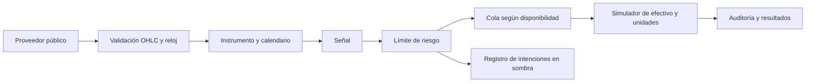

# Hacia varios mercados: alcance real y contratos pendientes

La idea de Patrick es un sistema adaptable a la mayoría de mercados digitales. Esa frase todavía necesita delimitar si incluye mercados no financieros. Se formuló una pregunta y se avanzó con mercados financieros como supuesto provisional. El TikTok no se pudo ver; no se extrajeron de él funciones ni se copió una interfaz imaginada.

## Separación implementada

El contrato Instrument contiene símbolo, clase, moneda de cotización, períodos por año y calendario. La señal usa la anualización del instrumento, sin tener que asumir que toda serie opera 365 sesiones. La implementación admite los nombres crypto_spot y equity_spot para describir instrumentos spot, pero SOLO el adaptador de datos cripto diario de Binance está implementado y probado con datos reales. Aceptar metadatos de acciones no equivale a soportar correctamente acciones.

## Matriz de capacidades

| Clase | Estado de evidencia | Trabajo obligatorio antes de afirmar soporte |
|---|---|---|
| Cripto spot diario | BTC/ETH/SOL, 2025, un proveedor; señales actuales observadas | Más períodos, venues y fricciones; tamaños mínimos y feed real; portfolio |
| Acciones y ETF | Metadatos básicos, sin pruebas con precios reales | Calendario, splits/dividendos, precios ajustados consistentes, divisa, sesgo de supervivencia |
| FX | No implementado; clase rechazada | Pips/unidades, cotización inversa, conversiones, sesiones y rollover |
| Futuros/perpetuos | No implementado; clase rechazada | Multiplicador, margen, liquidación, vencimiento/roll y funding |
| Opciones | No implementado | Cadena histórica, vencimientos, griegas y valoración/ejercicio |
| Predicciones, artículos digitales, comercio | Alcance pendiente de Patrick | Definir acción económica, precio observable, fees, inventario, liquidez, evento de cierre y objetivo |

## Qué reutilizamos y qué cambia

Se pueden reutilizar procedencia de datos, disponibilidad temporal, registro de experimentos, separación señal/riesgo y auditoría. Cada mercado debe aportar su calendario y su modelo económico de posiciones y costes. No hay una regla que convierta automáticamente una estrategia útil en cripto en útil en ETF o comercio electrónico.

Para la siguiente clase financiera, priorizar un adaptador de acciones/ETF con ajustes y sesiones explícitos, y ejecutar primero Cash/Buy & Hold antes de conectar la señal táctica. Mantener una cuenta y moneda de valoración inequívocas; no sumar curvas independientes como si fueran una cartera diversificada.

## Puerta hacia seguimiento

Ahora existe un observador puntual de señales con datos reales. La siguiente integración es una cuenta paper que consuma nuevas intenciones y precios posteriores a observed_at, con calendario y conciliación de fills virtuales. La primera captura no mide su rentabilidad futura. Para operar de verdad siguen pendientes controles de ejecución, instrumentos, costes reales y suficiente evidencia fuera de la muestra de desarrollo.
