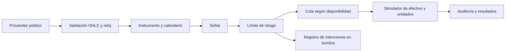

# P100 — Avance 002: primera evaluación histórica real y primera captura en sombra

Patrick, podemos empezar una prueba en sombra con datos reales. Ya se registró la primera captura de señales actuales. El avance aprobado es de ingeniería e investigación: todavía no acredita una estrategia lista para operar dinero.

Atlas — asistente de IA de OpenAI, colaborador técnico de Patrick. Revisión del 8 de septiembre de 2026 UTC (7 de septiembre en Costa Rica durante la captura).

## Qué está comprobado

- Se descargaron respuestas originales del endpoint público de Binance y se validaron 1095 velas: 365 días de 2025 para BTCUSDT, ETHUSDT y SOLUSDT. Se guardaron bytes originales, normalizados, URLs, hora de descarga y hashes.
- Se ejecutaron las 45 combinaciones del protocolo previo: tres instrumentos, cinco políticas y tres escenarios de costes, con curva y eventos completos. No se descartaron resultados desfavorables.
- Auditoría independiente del motor: 16425 estados y 14985 eventos reconciliados; hashes de 23 archivos previos y seis archivos de datos (tres crudos y tres normalizados) verificados.
- Pasaron 67 métodos de prueba: 52 anteriores, 11 de mercado/reloj/banda y cuatro de observación/persistencia. Se verificaron invariancia ante futuro alterado, espera por disponibilidad, límite de riesgo por encima de banda, datos incompletos y duplicados.
- Se registraron seis intenciones actuales: dos políticas en tres símbolos. La reproducción sin red confirmó las seis y detectó sus seis duplicados sin insertarlos otra vez. Órdenes enviadas: 0.

## El cambio temporal necesario

Las velas diarias del proveedor cierran un milisegundo antes de la siguiente apertura. La disponibilidad histórica exacta no está registrada en esos datos. Fijé antes del ensayo el supuesto close_time + 1 segundo; bajo ese supuesto la primera apertura elegible suele ser t+2. La nueva cola utiliza el tiempo disponible, no un desplazamiento ciego de una fila. Es una convención conservadora de investigación, no una medición de la latencia real del proveedor.

La primera señal usa 30 retornos; el primer fill es en índice 32 (2 de febrero de 2025). Buy & Hold comparte ese comienzo, por lo que su retorno NO es el retorno del año natural completo. Se termina valorando posiciones abiertas a mercado; no se cobra una liquidación final inexistente. Dos decisiones al final quedan pendientes.

## Resultados con comisión 10 pb y deslizamiento 5 pb por lado

Cada fila usa una cuenta simulada independiente de 10000 USDT. Retorno y drawdown son de la curva completa con el calentamiento común en efectivo. No son una cartera combinada ni rentabilidades esperadas.

| Activo | Política | Retorno neto | Drawdown | Rebalanceos con cantidad no nula | Omitidos por banda | Coste total USDT |
|---|---|---:|---:|---:|---:|---:|
| BTCUSDT | cash | 0.00% | 0.00% | 0 | 0 | 0.00 |
| BTCUSDT | buy_hold | -13.04% | -32.02% | 1 | 0 | 14.98 |
| BTCUSDT | core_risk | -4.33% | -14.04% | 333 | 0 | 29.20 |
| BTCUSDT | core_tactical_risk | 0.26% | -12.90% | 333 | 0 | 271.95 |
| BTCUSDT | core_tactical_band | 0.18% | -12.89% | 94 | 239 | 258.71 |
| ETHUSDT | cash | 0.00% | 0.00% | 0 | 0 | 0.00 |
| ETHUSDT | buy_hold | -4.82% | -52.81% | 1 | 0 | 14.98 |
| ETHUSDT | core_risk | 2.12% | -18.09% | 333 | 0 | 51.99 |
| ETHUSDT | core_tactical_risk | 8.71% | -12.04% | 333 | 0 | 100.62 |
| ETHUSDT | core_tactical_band | 8.21% | -11.95% | 58 | 275 | 80.16 |
| SOLUSDT | cash | 0.00% | 0.00% | 0 | 0 | 0.00 |
| SOLUSDT | buy_hold | -41.57% | -51.68% | 1 | 0 | 14.98 |
| SOLUSDT | core_risk | -7.43% | -15.88% | 333 | 0 | 48.95 |
| SOLUSDT | core_tactical_risk | -0.50% | -11.58% | 333 | 0 | 90.00 |
| SOLUSDT | core_tactical_band | 0.74% | -10.61% | 63 | 270 | 72.99 |

## Resultado de la hipótesis fijada antes de descargar

La banda fija de 5 puntos de exposición solo conserva una posición cuando la diferencia es menor que la banda, no supera el límite de riesgo y el objetivo no es cero. H1 exigía coste y turnover no mayores en cada activo. H2 exigía no perder más de 1 punto porcentual de retorno ni empeorar el drawdown más de 1 punto en cada activo.

| Activo | Ahorro de coste USDT | Delta retorno (pp) | Delta drawdown (pp) | H1 | H2 |
|---|---:|---:|---:|---|---|
| BTCUSDT | 13.24 | -0.079 | 0.006 | True | True |
| ETHUSDT | 20.47 | -0.492 | 0.083 | True | True |
| SOLUSDT | 17.01 | 1.237 | 0.974 | True | True |

Criterio conjunto aprobado: **True**. La promoción significa conservar esta variante para la siguiente prueba en sombra, no aprobación para operar dinero. BTC y ETH tuvieron un retorno algo menor con la banda; se conserva ese resultado porque estaba dentro de la tolerancia previa. El ahorro en número de rebalanceos es mucho mayor que el ahorro monetario: muchos de los rebalanceos eliminados eran pequeños.

## Sensibilidad a fricciones: variante con banda

En 0 pb también se elimina el deslizamiento; en 10/30 pb se mantienen 5 pb de deslizamiento por lado.

| Activo | Retorno a 0 pb | Retorno a 10 pb | Retorno a 30 pb |
|---|---:|---:|---:|
| BTCUSDT | 2.67% | 0.18% | -3.04% |
| ETHUSDT | 9.03% | 8.21% | 7.13% |
| SOLUSDT | 1.47% | 0.74% | -0.22% |

## Qué empezó realmente en sombra

Primera observación: 2026-09-08T05:05:08.463376+00:00. Última vela cerrada utilizada: 2026-09-07T23:59:59.999000+00:00. Se usaron las políticas core_risk y core_tactical_band como comparación. Se excluyó la vela diaria todavía en formación.

Se conservan intenciones y hora de observación real en SQLite. No hay broker, órdenes, fills virtuales posteriores ni P&L forward todavía. Cualquier próxima simulación de fills tendrá que usar precios posteriores a observed_at; no puede adjudicarse una apertura que ya pasó al observar la señal. Esta captura fue puntual y el proceso terminó: no hay un monitor recurrente activo.

## Interpretación y límites

Hecho experimental: en esta muestra y con estos supuestos, la banda superó el criterio de costes/degradación y el control temporal/contable pasó. Inferencia de trabajo: merece avanzar a observación prospectiva frente al mismo baseline de riesgo. No se infiere que los retornos vayan a repetirse.

Un año, tres criptoactivos correlacionados y un proveedor no representan la mayoría de mercados digitales. Los precios 2025 ya están consumidos para desarrollo y no son un holdout independiente. Los bloques trimestrales son resúmenes de la misma curva, sin reentrenamiento; no son validación walk-forward. No hubo ML ni ajuste de parámetros tras ver los resultados.

Los costes son supuestos por lado, sin spread variable, impacto por volumen, mínimos de orden, tamaño de lote, intereses sobre efectivo, funding ni tasas de conversión de USDT. Unidades fraccionarias y saldo sin apalancamiento. El límite de exposición actúa al rebalancear, no garantiza que el precio no haga derivar el peso intrabar. Los datos públicos descargados ahora pueden contener revisiones no disponibles históricamente.

## Problemas detectados y corregidos

1. Una prueba con timestamp en microsegundos provocó OSError en Windows al intentar convertirlo como milisegundos. Se cambió el parser para verificar primero el timestamp entero exacto contra el esperado, y luego construir las fechas. El test conserva la entrada incorrecta y ahora obtiene el rechazo explícito.
2. El primer intento de descarga falló por permisos de socket del entorno. Se conserva results/study_002/FETCH_FAILURE.json. Tras autorización automática de red se ejecutó study_002_retry con nuevo congelado previo. No hubo sustitución silenciosa de fuente o datos.
3. El administrador de contexto de SQLite confirma transacciones, pero no cierra automáticamente la conexión. Dos tests fallaron al limpiar archivos bloqueados en Windows. Se añadió cierre explícito de conexión y los 67 métodos pasaron. La salida fallida se conserva junto a la final.
4. El enlace TikTok no pudo abrirse. No se vio el video ni se atribuyeron requisitos a su contenido.

## Próximo paso significativo

Podemos pasar a una prueba en sombra con nuevas sesiones. El siguiente componente debe transformar las intenciones ya persistidas en fills virtuales posteriores a su observación, manteniendo cuenta de efectivo y comparación core_risk frente a core_tactical_band. Primero exigir continuidad de registros, ausencia de duplicados y reconciliación; la evaluación económica necesita un período prospectivo y criterios fijados antes de observarlo.

Para ampliar clases de mercado, el próximo adaptador financiero debe resolver calendario, ajustes corporativos y divisa de acciones/ETF antes de reutilizar señales. ARQUITECTURA_MERCADOS.md distingue lo implementado de lo pendiente. El alcance de mercados no financieros queda pendiente de la precisión de Patrick; no impidió completar esta etapa.

No se usó el restablecimiento de uso de Patrick. La entrega incluye código, pruebas, datos crudos, resultados completos y registros actuales; los paquetes anteriores permanecen separados.

## Fuentes y trazabilidad

La API oficial describe las velas, su esquema y el endpoint público de datos: [documentación de mercado](https://developers.binance.com/en/docs/catalog/core-trading-spot-trading/api/rest-api/market), [documentación del endpoint de datos públicos](https://raw.githubusercontent.com/binance/binance-spot-api-docs/master/rest-api.md). El acceso al endpoint de este ensayo fue de lectura, sin claves. Las URLs exactas y hashes de las respuestas están en DATA_CATALOG.json.

- BTCUSDT: [solicitud original](https://data-api.binance.vision/api/v3/klines?symbol=BTCUSDT&interval=1d&startTime=1735689600000&endTime=1767225599999&limit=1000), SHA-256 `3bc3222ceea83a7d4cbd7ddc22f20c412089beac10ddb17f3dea5e3d92c76ab7`, descarga 2026-09-08T05:03:24.367353+00:00.
- ETHUSDT: [solicitud original](https://data-api.binance.vision/api/v3/klines?symbol=ETHUSDT&interval=1d&startTime=1735689600000&endTime=1767225599999&limit=1000), SHA-256 `bde55cdfd3e747d3246bab1a23c1117ae7ea1c336342367b015de982636378dd`, descarga 2026-09-08T05:03:25.989826+00:00.
- SOLUSDT: [solicitud original](https://data-api.binance.vision/api/v3/klines?symbol=SOLUSDT&interval=1d&startTime=1735689600000&endTime=1767225599999&limit=1000), SHA-256 `51e27e96587eb220071ae497c98fc0aa4bd1c90382b0bf88f5c0c3c837f226e1`, descarga 2026-09-08T05:03:27.412071+00:00.

# Solicitud de Patrick para este avance

Patrick aportó el enlace https://vt.tiktok.com/ZSqrXtKt6/ y explicó que el video se parece aproximadamente a lo que quiere lograr, pero que su proyecto debe funcionar en la mayoría de mercados digitales. Solicitó seguir creando y probando hasta poder proponer una prueba real o un paso significativo, y reiteró que los fracasos y pérdidas son parte del proceso de investigación.

Interpretación aplicada: avanzar con autonomía en desarrollo, datos públicos y simulación. No se interpretó esa tolerancia a pérdidas como una orden para mover dinero o abrir posiciones. No se usaron credenciales ni restablecimientos de uso. Se preguntó si el alcance incluye mercados financieros o también predicciones/artículos digitales/comercio; al preparar este avance no se había recibido esa precisión.

El video no se pudo abrir por la restricción del lector web. Su contenido no se usó como evidencia ni especificación técnica.

# P100 — ensayo 002, fijado antes de consultar precios

## Objetivo

Pasar del laboratorio sintético a una primera prueba histórica con datos públicos reales. Aislar el efecto de una banda de rebalanceo y comprobar un reloj conservador de disponibilidad. No es una prueba con dinero, no reproduce v0.5 y no acredita rentabilidad futura.

## Diseño previo

- Universo fijo por continuidad del roadmap: BTCUSDT, ETHUSDT, SOLUSDT spot. Son tres activos de una sola clase y un solo proveedor, no tres mercados independientes.
- Fuente propuesta: API pública de Binance, endpoint GET /api/v3/klines, frecuencia 1d UTC, año civil 2025 completo (365 filas por símbolo). Se conservan respuesta cruda, URL, fecha de consulta, hash y CSV normalizado. Los datos descargados se consideran desarrollo histórico consumido, no holdout desconocido.
- Si la fuente no está disponible o no supera las validaciones, no sustituir precios ni fuente silenciosamente; registrar fallo y continuar ingeniería con fixtures.
- OHLC completo, volumen no negativo, fechas únicas ordenadas, sin huecos de días en cripto 24/7; rechazar barras incompletas o rangos inválidos. No interpolación ni corrección silenciosa.
- Disponibilidad histórica REAL desconocida: modelar close_time + 1 segundo. Señal calculada con el prefijo a esa disponibilidad. Fill en la primera apertura posterior, por tanto normalmente t+2 en velas diarias contiguas. Es conservadurismo temporal, no reconstrucción del feed real.
- Primeros 30 retornos de cada serie para calentamiento. Sin entrenamiento ni selección de hiperparámetros. Mantener el intervalo quemado de 2024 fuera de esta ejecución no vuelve independiente a 2025.
- Cuatro políticas: cash, buy_hold, core_risk, core_tactical_risk; una quinta, core_tactical_band, usa la misma señal/riesgo y una banda fija de 5 puntos porcentuales al ejecutar. Si la diferencia entre peso actual y objetivo es menor que 0.05, conservar posición solo si no excede el límite de riesgo; objetivo cero siempre liquida en el fill simulado. La igualdad a 0.05 rebalancea.
- Core=0.40, overlay=±0.30, umbral tendencia ±0.02 a 30 retornos, volatilidad muestral anualizada sqrt(365), mínimo 0.01, presupuesto 0.20, confianza constante 1. No ML, cortos ni apalancamiento.
- Comisiones por lado 0/10/30 pb; deslizamiento 0/5/5 pb respectivamente. 45 ejecuciones totales. Un capital separado de 10000 USDT por activo y política; no sumar estas cuentas como una cartera.
- Publicar retorno, drawdown, exposición, turnover, costes, órdenes pendientes, días y trades para las 45 ejecuciones. Publicar bloques trimestrales derivados de la curva continua; no llamarlos folds walk-forward ni muestras independientes.

## Hipótesis y puerta siguiente

H1 (costes): a comisión 10 pb, la banda reduce o iguala turnover y coste frente a core_tactical_risk en cada uno de los tres activos. H2 (degradación): en cada activo, retorno no empeora más de 1 punto porcentual y drawdown no empeora más de 1 punto porcentual. Para promover la banda deben cumplirse H1 y H2 en TODOS. No cambiar tolerancias al ver resultados. El resultado de este ensayo sirve para desarrollo; no basta para desplegar una estrategia rentable.

Puerta de ingeniería para una prueba en sombra: pruebas causales y contables pasan; parser rechaza datos corruptos; entradas y configuración están congeladas; no existe conexión para enviar órdenes; registro de decisiones persistente detecta duplicados. Si falta alguna, completar antes de proponer seguimiento. Una prueba en sombra observa datos reales y registra intenciones sin dinero. No se inicia un servicio recurrente sin indicar claramente su alcance.

## Ampliación de mercados

Separar proveedor, instrumento, calendario, anualización y ejecución. Admitir un contrato OHLC normalizado para spot; verificar evidencia por clase. Acciones/ETF necesitan ajustes corporativos y calendarios de sesión; FX conversiones y calendario; futuros vencimientos, multiplicadores, margen y funding. Esos adaptadores económicos no están implementados por aceptar una etiqueta. Mercados no financieros requieren definir valor, liquidez, acciones y objetivos con Patrick.

## Referencias revisadas

- https://developers.binance.com/en/docs/catalog/core-trading-spot-trading/api/rest-api/market — esquema oficial de klines (12 campos, timestamps, paginación y UTC).
- https://github.com/binance/binance-public-data — referencia del proveedor para archivos públicos; no es fuente descargada en este ensayo.
- TikTok aportado por Patrick: https://vt.tiktok.com/ZSqrXtKt6/ . El navegador de investigación rechazó la apertura del enlace; no se vio el video ni se extrajeron requisitos de su contenido.

# Hacia varios mercados: alcance real y contratos pendientes

La idea de Patrick es un sistema adaptable a la mayoría de mercados digitales. Esa frase todavía necesita delimitar si incluye mercados no financieros. Se formuló una pregunta y se avanzó con mercados financieros como supuesto provisional. El TikTok no se pudo ver; no se extrajeron de él funciones ni se copió una interfaz imaginada.

## Separación implementada



El contrato Instrument contiene símbolo, clase, moneda de cotización, períodos por año y calendario. La señal usa la anualización del instrumento, sin tener que asumir que toda serie opera 365 sesiones. La implementación admite los nombres crypto_spot y equity_spot para describir instrumentos spot, pero SOLO el adaptador de datos cripto diario de Binance está implementado y probado con datos reales. Aceptar metadatos de acciones no equivale a soportar correctamente acciones.

## Matriz de capacidades

| Clase | Estado de evidencia | Trabajo obligatorio antes de afirmar soporte |
|---|---|---|
| Cripto spot diario | BTC/ETH/SOL, 2025, un proveedor; señales actuales observadas | Más períodos, venues y fricciones; tamaños mínimos y feed real; portfolio |
| Acciones y ETF | Metadatos básicos, sin pruebas con precios reales | Calendario, splits/dividendos, precios ajustados consistentes, divisa, sesgo de supervivencia |
| FX | No implementado; clase rechazada | Pips/unidades, cotización inversa, conversiones, sesiones y rollover |
| Futuros/perpetuos | No implementado; clase rechazada | Multiplicador, margen, liquidación, vencimiento/roll y funding |
| Opciones | No implementado | Cadena histórica, vencimientos, griegas y valoración/ejercicio |
| Predicciones, artículos digitales, comercio | Alcance pendiente de Patrick | Definir acción económica, precio observable, fees, inventario, liquidez, evento de cierre y objetivo |

## Qué reutilizamos y qué cambia

Se pueden reutilizar procedencia de datos, disponibilidad temporal, registro de experimentos, separación señal/riesgo y auditoría. Cada mercado debe aportar su calendario y su modelo económico de posiciones y costes. No hay una regla que convierta automáticamente una estrategia útil en cripto en útil en ETF o comercio electrónico.

Para la siguiente clase financiera, priorizar un adaptador de acciones/ETF con ajustes y sesiones explícitos, y ejecutar primero Cash/Buy & Hold antes de conectar la señal táctica. Mantener una cuenta y moneda de valoración inequívocas; no sumar curvas independientes como si fueran una cartera diversificada.

## Puerta hacia seguimiento

Ahora existe un observador puntual de señales con datos reales. La siguiente integración es una cuenta paper que consuma nuevas intenciones y precios posteriores a observed_at, con calendario y conciliación de fills virtuales. La primera captura no mide su rentabilidad futura. Para operar de verdad siguen pendientes controles de ejecución, instrumentos, costes reales y suficiente evidencia fuera de la muestra de desarrollo.

# P100 — avance 002: datos reales y observación en sombra

Leer AVANCE_002.md y ARQUITECTURA_MERCADOS.md. El protocolo previo está en PROTOCOL_002.md. Este directorio es una revisión independiente; no modifica P100_LAB ni los archivos históricos.

## Ejecutar sin red

Python 3.12, biblioteca estándar. Desde esta carpeta:

```text
python -B -m unittest discover -s tests -v
python -B audit_study.py
python -B audit_shadow.py
python -B verify_delivery.py
```

El auditor histórico vuelve a comprobar los 45 resultados guardados y los hashes congelados. El auditor en sombra reproduce la primera captura y prueba que repetirla no duplica las seis intenciones; está diseñado para la entrega inicial con seis registros. Tras acumular nuevas sesiones deberá adaptarse a la cantidad de registros, conservando esta entrega como evidencia inicial.

## Captura nueva de observación

```text
python -B -m market_lab.shadow
```

Hace tres solicitudes HTTPS públicas y termina. Solo registra intenciones calculadas con velas cerradas, junto a la hora real de observación. No mantiene un servicio ni envía órdenes. La red puede requerir autorización del entorno. La repetición de una vela/política con idéntico contenido es idempotente; si cambian datos o código para esa misma clave, se rechaza el conflicto y se requiere una nueva revisión deliberada.

La última señal no debe ejecutarse retrospectivamente en una apertura anterior a su hora real de observación. El registro todavía no es una cuenta paper con fills futuros; esa integración es una siguiente etapa.

## Estudio histórico y reproducción

results/study_002 contiene el intento inicial bloqueado por permisos de red. results/study_002_retry contiene la ejecución completa autorizada, congelada antes de obtener precios, con 45 curvas. Los originales se guardan en data/. Todos los precios de 2025 son desarrollo consumido.

Para reproducir con nuevas descargas, usa una copia de trabajo limpia del código, tests, config y protocolo, con data/ vacío, y un identificador nuevo:

```text
python -B -m market_lab.study --run reproduction_001
```

El runner rechaza datos existentes para evitar sobrescribir los originales. Para verificar la entrega actual sin descargar de nuevo, usa audit_study.py. El servidor puede revisar históricos; comparar siempre hashes de datos, código y métricas.

## Contenido

- market_lab/data.py: contrato de instrumento y parser Binance diario con validaciones OHLCV/UTC/cobertura.
- market_lab/execution.py: cola de disponibilidad y banda con prioridad del límite de riesgo.
- market_lab/signals.py: políticas fijas con anualización por instrumento.
- market_lab/study.py: descarga pública, congelados, ensayo, trimestres y evaluación de hipótesis.
- market_lab/shadow.py: observación puntual de datos actuales y registro SQLite de intenciones.
- p100_foundations/ y p100_lab/: copias de la base anterior. El estudio nuevo usa market_lab.execution; p100_lab.engine aporta la aritmética de rebalanceo ya probada. El runner sintético anterior conserva su propio reloj y no debe confundirse con el nuevo.
- tests/: 52 métodos anteriores y 15 nuevos (11 mercado/ejecución, cuatro observador).
- results/tests_pre_data.log, tests_shadow_initial_failure.log, tests_final.log: evidencia de pruebas y del fallo SQLite corregido.
- data/: respuestas originales y CSV normalizados de los tres instrumentos.
- results/study_002_retry/: catálogo, congelados, métricas, curvas, trimestres, hipótesis y auditoría.
- results/shadow/: primera captura, respuestas originales, seis intenciones y auditoría.
- CUADERNO_TECNICO_002.md: informe y código para lectura continua.
- MANIFEST.json: hashes de la entrega. Nuevas capturas pueden cambiar la base SQLite; conserva el ZIP como revisión inicial verificable.

Sin instalación de broker, credenciales, apalancamiento ni automatización recurrente.


# Anexo: código y pruebas


## market_lab/__init__.py

```python
"""Contratos de datos, reloj y simulación en sombra de P100."""

```


## market_lab/data.py

```python
from dataclasses import dataclass
from datetime import datetime, timedelta, timezone
import math
from p100_lab.engine import Bar
from p100_foundations.validation import finite_number


@dataclass(frozen=True)
class Instrument:
    symbol: str
    asset_class: str
    quote: str
    periods_per_year: int
    calendar: str

    def __post_init__(self):
        if not self.symbol or not self.quote:
            raise ValueError("instrumento sin identificar")
        if self.asset_class not in ("crypto_spot", "equity_spot"):
            raise ValueError("clase sin modelo de ejecución implementado")
        if isinstance(self.periods_per_year, bool) or not isinstance(self.periods_per_year, int) or self.periods_per_year<=0:
            raise ValueError("anualización inválida")
        if self.calendar not in ("daily_24x7", "explicit_sessions"):
            raise ValueError("calendario desconocido")


def parse_klines(raw, instrument, start, end, *, latency_seconds=1):
    """Adapter Binance 1d; expected interval [start,end), known completed historical bars."""
    if instrument.asset_class != "crypto_spot" or instrument.calendar != "daily_24x7" or instrument.periods_per_year != 365:
        raise ValueError("este adaptador solo admite spot cripto diario UTC")
    if not 0 <= finite_number(latency_seconds, "latency") < 86400:
        raise ValueError("latencia diaria inválida")
    if start.tzinfo is None or end.tzinfo is None or start >= end:
        raise ValueError("rango inválido")
    if not isinstance(raw, list) or len(raw) != (end-start).days:
        raise ValueError("cobertura incompleta")
    bars, normalized = [], []
    for i, row in enumerate(raw):
        if not isinstance(row, list) or len(row) != 12:
            raise ValueError("fila klines inválida")
        if type(row[0]) is not int or type(row[6]) is not int:
            raise ValueError("timestamps deben ser enteros en milisegundos")
        expected = start + timedelta(days=i)
        expected_close = expected+timedelta(days=1, milliseconds=-1)
        if row[0] != int(expected.timestamp()*1000) or row[6] != int(expected_close.timestamp()*1000):
            raise ValueError("hueco, duplicado, unidad temporal o duración incorrecta")
        opening, closing = expected, expected_close
        o, h, l, c, v = [float(row[j]) for j in (1, 2, 3, 4, 5)]
        if not all(math.isfinite(x) for x in (o,h,l,c,v)) or min(o,h,l,c)<=0 or v<0:
            raise ValueError("OHLCV no finito o fuera de rango")
        if not l <= min(o,c) <= max(o,c) <= h:
            raise ValueError("OHLC inconsistente")
        available = closing + timedelta(seconds=latency_seconds)
        bars.append(Bar(opening, closing, available, o, c))
        normalized.append(dict(symbol=instrument.symbol, open_time=opening.isoformat(), close_time=closing.isoformat(),
                               available_at_assumed=available.isoformat(), open=o, high=h, low=l, close=c, volume=v))
    return bars, normalized

```


## market_lab/execution.py

```python
"""Execution from queued decisions; eligibility follows availability, not row shift."""
from dataclasses import dataclass, asdict
from datetime import timedelta
from p100_lab.engine import Costs, rebalance
from p100_foundations.validation import finite_number, aware_time


@dataclass(frozen=True)
class Target:
    weight: float
    cap: float = 1.0
    band: float = 0.0

    def __post_init__(self):
        for name in ("weight", "cap", "band"):
            if not 0 <= finite_number(getattr(self, name), name) <= 1:
                raise ValueError("objetivo inválido")
        if self.weight > self.cap:
            raise ValueError("objetivo excede límite")


def run(bars, signal, costs=Costs(), initial_cash=10000.):
    if not bars or finite_number(initial_cash, "capital") <= 0:
        raise ValueError("serie/capital inválido")
    cash, units, peak, dd = initial_cash, 0., initial_cash, 0.
    history, pending, rows, events = [], [], [], []
    for index, bar in enumerate(bars):
        op, cl, av = (aware_time(getattr(bar,n),n) for n in ("open_time","close_time","available_at"))
        if not op < cl <= av or av-cl >= timedelta(days=1):
            raise ValueError("reloj o retraso no soportado")
        if history and (op <= history[-1].close_time or av <= history[-1].available_at):
            raise ValueError("orden temporal inválido")
        if min(finite_number(bar.open,"open"), finite_number(bar.close,"close")) <= 0:
            raise ValueError("precio inválido")
        eligible = [d for d in pending if d["time"] < op]
        pending = [d for d in pending if d["time"] >= op]
        if eligible:
            decision = eligible[-1]
            target = decision["target"]
            equity = cash + units*bar.open
            current = units*bar.open/equity
            skip = (target.band>0 and abs(current-target.weight)<target.band
                    and current<=target.cap and target.weight>0)
            event = dict(index=index, decision_index=decision["index"], decision_time=decision["time"].isoformat(),
                         fill_time=op.isoformat(), current_weight=current, requested=asdict(target),
                         skipped=skip, superseded=len(eligible)-1)
            if not skip:
                fill = rebalance(cash, units, bar.open, target.weight, costs)
                cash, units = fill.cash, fill.units
                event["fill"] = asdict(fill)
            events.append(event)
        equity = cash + units*bar.close
        finite_number(equity, "equity")
        peak = max(peak, equity)
        dd = min(dd, equity/peak-1)
        history.append(bar)
        # Availability is strictly monotone: entire prefix is known at this decision time.
        target = signal(tuple(history))
        if target is not None:
            if not isinstance(target, Target):
                raise ValueError("el callback debe devolver Target o None")
            pending.append(dict(index=index, time=av, target=target))
        rows.append(dict(index=index, time=cl.isoformat(), cash=cash, units=units, equity=equity,
                         exposure=units*bar.close/equity, next_target=asdict(target) if target else None))
    fills = [e["fill"] for e in events if "fill" in e]
    metrics = dict(total_return=equity/initial_cash-1, max_drawdown=dd, ending_equity=equity,
                   fees=sum(f["fee"] for f in fills), slippage=sum(f["slippage"] for f in fills),
                   turnover=sum(abs(e["fill"]["quantity"])*bars[e["index"]].open/e["fill"]["equity_before"] for e in events if "fill" in e),
                   mean_exposure=sum(r["exposure"] for r in rows)/len(rows),
                   trades=sum(abs(f["quantity"])>1e-10 for f in fills), band_skips=sum(e["skipped"] for e in events),
                   pending_unfilled=len(pending), bars=len(bars))
    return dict(metrics=metrics, rows=rows, events=events)

```


## market_lab/shadow.py

```python
"""One-shot observation of closed public bars; persistent intentions, no broker or orders."""
from dataclasses import asdict
from contextlib import closing
from datetime import datetime, timedelta, timezone
import hashlib
import json
from pathlib import Path
import sqlite3

from .data import Instrument,parse_klines
from .signals import make_signal
from .study import public_get, ROOT, SYMBOLS


def record_intention(database, key, payload, observed_at):
    canonical=json.dumps(payload,sort_keys=True,separators=(",",":"),allow_nan=False)
    digest=hashlib.sha256(canonical.encode()).hexdigest()
    with closing(sqlite3.connect(database)) as db, db:
        db.execute("CREATE TABLE IF NOT EXISTS intentions (key TEXT PRIMARY KEY, payload TEXT NOT NULL, hash TEXT NOT NULL, observed_at TEXT NOT NULL)")
        db.execute("BEGIN IMMEDIATE")
        row=db.execute("SELECT payload, hash FROM intentions WHERE key=?",(key,)).fetchone()
        if row:
            if row!=(canonical,digest):
                raise ValueError("conflicto: misma decisión con contenido diferente")
            return "duplicate"
        db.execute("INSERT INTO intentions VALUES (?,?,?,?)",(key,canonical,digest,observed_at))
    return "recorded"


def closed_history(raw, observed_at, symbol):
    # Local acquisition time records when this research process actually saw the data.
    completed=[r for r in raw if type(r[6]) is int and r[6]/1000+1<=observed_at.timestamp()]
    if len(completed)<31:
        raise ValueError("historial cerrado insuficiente")
    end_ms=completed[-1][6]+1
    end=datetime.fromtimestamp(end_ms/1000,timezone.utc)
    start=datetime.fromtimestamp(completed[0][0]/1000,timezone.utc)
    if observed_at-end>timedelta(days=2):
        raise ValueError("datos demasiado antiguos para observación actual")
    instrument=Instrument(symbol,"crypto_spot","USDT",365,"daily_24x7")
    bars,_=parse_klines(completed,instrument,start,end)
    return instrument,bars,completed


def main():
    root=ROOT/"results/shadow"
    root.mkdir(exist_ok=True,parents=True)
    stamp=datetime.now(timezone.utc).strftime("%Y%m%dT%H%M%S%fZ")
    capture=root/stamp
    capture.mkdir(exist_ok=False)
    code_files=[*sorted((ROOT/"market_lab").glob("*.py")), *sorted((ROOT/"p100_foundations").glob("*.py"))]
    code_hash=hashlib.sha256(b"".join(p.name.encode()+p.read_bytes() for p in code_files)).hexdigest()
    summary=[]
    for symbol in SYMBOLS:
        url,content=public_get(dict(symbol=symbol,interval="1d",limit=65))
        observed=datetime.now(timezone.utc)
        (capture/(symbol+".raw.json")).write_bytes(content)
        instrument,bars,completed=closed_history(json.loads(content),observed,symbol)
        data_hash=hashlib.sha256(json.dumps(completed,separators=(",",":")).encode()).hexdigest()
        for policy in ("core_risk","core_tactical_band"):
            target=make_signal(policy,instrument)(tuple(bars))
            payload=dict(symbol=symbol,policy=policy,bar_close=bars[-1].close_time.isoformat(),
                         target=asdict(target),data_sha256=data_hash,code_sha256=code_hash,
                         execution_enabled=False,type="RESEARCH_INTENTION_ONLY")
            key=symbol+"|"+policy+"|"+payload["bar_close"]
            status=record_intention(root/"intentions.sqlite",key,payload,observed.isoformat())
            summary.append(dict(**payload,status=status,observed_at=observed.isoformat(),
                                earliest_execution="NOT_EXECUTED; any future simulation must use an opening strictly after observed_at",source_url=url))
    (capture/"SNAPSHOT.json").write_text(json.dumps(summary,indent=2),encoding="utf-8")
    print(json.dumps(dict(capture=str(capture),intentions=len(summary),statuses=[r["status"] for r in summary],execution_enabled=False)))


if __name__=="__main__":
    main()

```


## market_lab/signals.py

```python
from math import sqrt
from statistics import stdev
from p100_foundations.regimes import classify_regime
from p100_foundations.strategy import ExposureIntent, propose_exposure
from p100_foundations.risk import size_exposure
from .execution import Target

POLICIES = ("cash", "buy_hold", "core_risk", "core_tactical_risk", "core_tactical_band")


def make_signal(policy, instrument):
    if policy not in POLICIES:
        raise ValueError("política desconocida")
    def signal(history):
        if len(history)<31:
            return None
        if policy=="cash":
            return Target(0.)
        if policy=="buy_hold":
            return Target(1.)
        prices = [b.close for b in history[-31:]]
        returns = [b/a-1 for a,b in zip(prices,prices[1:])]
        vol = max(.01, stdev(returns)*sqrt(instrument.periods_per_year))
        regime = classify_regime(prices[-1]/prices[0]-1, vol)
        intent = ExposureIntent(.4, 0., 1.) if policy=="core_risk" else propose_exposure(regime)
        risk = size_exposure(intent, vol)
        if not risk.allowed:
            raise ValueError("riesgo rechazó señal")
        return Target(risk.target_exposure, risk.risk_cap, .05 if policy=="core_tactical_band" else 0.)
    return signal

```


## market_lab/study.py

```python
"""Freeze, fetch public data and run the prespecified historical development study."""
import argparse
import csv
from dataclasses import asdict
from datetime import datetime, timezone
import gzip
import hashlib
import json
from pathlib import Path
import urllib.parse
import urllib.request

from p100_lab.engine import Costs
from .data import Instrument, parse_klines
from .execution import run
from .signals import POLICIES, make_signal

ROOT = Path(__file__).resolve().parents[1]
START = datetime(2025,1,1,tzinfo=timezone.utc)
END = datetime(2026,1,1,tzinfo=timezone.utc)
SYMBOLS = ("BTCUSDT", "ETHUSDT", "SOLUSDT")


def sha(path):
    return hashlib.sha256(path.read_bytes()).hexdigest()


def write_json(path, obj):
    with path.open("x", encoding="utf-8") as f:
        json.dump(obj, f, indent=2, allow_nan=False)


def public_get(params):
    url = "https://data-api.binance.vision/api/v3/klines?"+urllib.parse.urlencode(params)
    req = urllib.request.Request(url, headers={"User-Agent":"P100-Research/0.2"})
    with urllib.request.urlopen(req, timeout=30) as response:
        content = response.read()
    return url, content


def main():
    parser=argparse.ArgumentParser()
    parser.add_argument("--run",default="study_002")
    args=parser.parse_args()
    if not args.run.replace("_", "").isalnum():
        raise ValueError("identificador de ejecución inválido")
    out = ROOT/"results"/args.run
    out.mkdir(exist_ok=False, parents=True)
    source_files = [ROOT/"PROTOCOL_002.md", *sorted(ROOT.glob("market_lab/*.py")),
                    *sorted(ROOT.glob("p100_lab/*.py")), *sorted(ROOT.glob("p100_foundations/*.py")), *sorted(ROOT.glob("tests/*.py"))]
    write_json(out/"PRE_DATA_FREEZE.json", dict(created_utc=datetime.now(timezone.utc).isoformat(),
        experiment="study_002", status="HISTORICAL_DEVELOPMENT_NOT_UNSEEN_HOLDOUT",
        symbols=SYMBOLS, start=START.isoformat(), end_exclusive=END.isoformat(), policies=POLICIES,
        fees_bps=[0,10,30], latency_assumed_seconds=1, band=.05,
        hashes={p.relative_to(ROOT).as_posix():sha(p) for p in source_files}))
    datasets, catalog = {}, []
    for symbol in SYMBOLS:
        raw_path=ROOT/"data"/(symbol+"_2025.raw.json")
        if raw_path.exists():
            raise FileExistsError("No sobrescribir datos existentes")
        try:
            url, content=public_get(dict(symbol=symbol,interval="1d",startTime=int(START.timestamp()*1000),
                                        endTime=int(END.timestamp()*1000)-1,limit=1000))
            raw_path.write_bytes(content)
            instrument=Instrument(symbol,"crypto_spot","USDT",365,"daily_24x7")
            bars, normalized=parse_klines(json.loads(content),instrument,START,END)
            normalized_path=ROOT/"data"/(symbol+"_2025.csv")
            with normalized_path.open("x", newline="",encoding="utf-8") as f:
                w=csv.DictWriter(f,fieldnames=list(normalized[0])); w.writeheader(); w.writerows(normalized)
            catalog.append(dict(instrument=asdict(instrument), url=url, fetched_utc=datetime.now(timezone.utc).isoformat(),
                                rows=len(bars), raw_file=raw_path.relative_to(ROOT).as_posix(), raw_sha256=sha(raw_path),
                                normalized_file=normalized_path.relative_to(ROOT).as_posix(), normalized_sha256=sha(normalized_path),
                                availability="ASSUMED_close_time_plus_1_second", license="Public endpoint; redistribution rights not independently established"))
            datasets[symbol]=instrument,bars
            print(symbol+": 365 barras reales validadas",flush=True)
        except Exception as exc:
            write_json(out/"FETCH_FAILURE.json",dict(symbol=symbol,error=repr(exc),time=datetime.now(timezone.utc).isoformat()))
            raise
    write_json(out/"DATA_CATALOG.json",catalog)
    write_json(out/"PRE_RUN_DATA_FREEZE.json",{c["raw_file"]:c["raw_sha256"] for c in catalog})
    all_metrics, quarterly=[] ,[]
    with gzip.open(out/"all_ledgers.jsonl.gz","wt",encoding="utf-8") as ledger:
        for symbol,(instrument,bars) in datasets.items():
            for fee in (0,10,30):
                for policy in POLICIES:
                    result=run(bars,make_signal(policy,instrument),Costs(fee,0 if fee==0 else 5))
                    metadata=dict(symbol=symbol,fee_bps=fee,policy=policy)
                    all_metrics.append(dict(**metadata,**result["metrics"]))
                    ledger.write(json.dumps(dict(**metadata,**result),separators=(",",":"),allow_nan=False)+"\n")
                    previous=10000.
                    for q in range(1,5):
                        block=[r for r in result["rows"] if (int(r["time"][5:7])-1)//3+1==q]
                        ending=block[-1]["equity"]
                        quarterly.append(dict(**metadata,quarter=q,starting_equity=previous,ending_equity=ending,total_return=ending/previous-1))
                        previous=ending
    for filename,rows in (("all_metrics.csv",all_metrics),("quarterly.csv",quarterly)):
        with (out/filename).open("x",newline="",encoding="utf-8") as f:
            w=csv.DictWriter(f,fieldnames=list(rows[0])); w.writeheader(); w.writerows(rows)
    decisions=[]
    for symbol in SYMBOLS:
        a=next(r for r in all_metrics if r["symbol"]==symbol and r["fee_bps"]==10 and r["policy"]=="core_tactical_band")
        b=next(r for r in all_metrics if r["symbol"]==symbol and r["fee_bps"]==10 and r["policy"]=="core_tactical_risk")
        h1=a["turnover"]<=b["turnover"] and a["fees"]+a["slippage"]<=b["fees"]+b["slippage"]
        h2=a["total_return"]-b["total_return"]>=-.01 and a["max_drawdown"]-b["max_drawdown"]>=-.01
        decisions.append(dict(symbol=symbol, H1_costs=h1, H2_degradation=h2,
                              return_delta=a["total_return"]-b["total_return"], drawdown_delta=a["max_drawdown"]-b["max_drawdown"],
                              turnover_delta=a["turnover"]-b["turnover"], costs_delta=a["fees"]+a["slippage"]-b["fees"]-b["slippage"]))
    conclusion=dict(promote_band=all(d["H1_costs"] and d["H2_degradation"] for d in decisions),decisions=decisions,
                    runs=len(all_metrics), status="DEVELOPMENT_RESULT_NOT_PROOF_OF_ALPHA")
    write_json(out/"HYPOTHESIS_RESULT.json",conclusion)
    print(json.dumps(conclusion),flush=True)


if __name__=="__main__":
    main()

```


## p100_foundations/__init__.py

```python
"""Nuevos componentes aislados de investigación; no reconstruyen P100 v0.5."""

__version__ = "0.6.0-foundations.1"

```


## p100_foundations/__main__.py

```python
"""CLI local para congelar/verificar esta contribución, sin acceder a la red."""

import argparse
import json
from pathlib import Path

from .freeze import build_manifest, verify_manifest, write_manifest


def main() -> int:
    parser = argparse.ArgumentParser(description=__doc__)
    parser.add_argument("action", choices=("freeze", "verify"))
    parser.add_argument("--manifest", default="FREEZE_MANIFEST.json")
    args = parser.parse_args()
    root = Path(__file__).resolve().parent.parent
    destination = (root / args.manifest).resolve()
    if not destination.is_relative_to(root):
        parser.error("el manifiesto debe estar dentro de v06_foundations")
    if args.action == "freeze":
        config = json.loads((root / "config" / "example.json").read_text(encoding="utf-8"))
        code_files = [path.relative_to(root).as_posix() for folder in ("p100_foundations", "tests") for path in (root / folder).rglob("*.py")]
        code_files.append("config/example.json")
        manifest = build_manifest(root, code_files, [], config)
        write_manifest(destination, manifest)
        print(json.dumps({"status": "FROZEN_COMPONENT_BASELINE", "manifest_sha256": manifest["manifest_sha256"], "data_status": manifest["data_status"], "holdout_status": manifest["holdout_status"]}, sort_keys=True))
        return 0
    manifest = json.loads(destination.read_text(encoding="utf-8"))
    errors = verify_manifest(root, manifest)
    print(json.dumps({"status": "PASS" if not errors else "FAIL", "errors": errors}, sort_keys=True))
    return int(bool(errors))


if __name__ == "__main__":
    raise SystemExit(main())

```


## p100_foundations/features.py

```python
"""Feature mínima causal: retorno simple disponible al cierre de la decisión."""

from dataclasses import dataclass
from datetime import datetime
from typing import Iterable

from .validation import aware_time, finite_number


@dataclass(frozen=True)
class Observation:
    event_time: datetime
    available_at: datetime
    close: float


def trailing_return(observations: Iterable[Observation], as_of: datetime, lookback: int) -> float:
    """Usa las últimas lookback+1 observaciones conocidas; no rellena huecos.

    lookback cuenta observaciones, no duración ni sesiones. El resultado se
    conoce en as_of y NO implica que se pueda ejecutar al mismo precio.
    """
    cutoff = aware_time(as_of, "as_of")
    if isinstance(lookback, bool) or not isinstance(lookback, int) or lookback < 1:
        raise ValueError("lookback debe ser un entero positivo")
    eligible = []
    for row in observations:
        event = aware_time(row.event_time, "event_time")
        available = aware_time(row.available_at, "available_at")
        if available < event:
            raise ValueError("available_at no puede preceder event_time")
        if event <= cutoff and available <= cutoff:
            close = finite_number(row.close, "close")
            if close <= 0:
                raise ValueError("close debe ser positivo")
            eligible.append((event, close))
    eligible.sort(key=lambda pair: pair[0])
    if len({event for event, _ in eligible}) != len(eligible):
        raise ValueError("event_time duplicado entre observaciones disponibles")
    if len(eligible) <= lookback:
        raise ValueError("historial disponible insuficiente")
    return finite_number(eligible[-1][1] / eligible[-1 - lookback][1] - 1, "trailing_return")

```


## p100_foundations/freeze.py

```python
"""Manifiesto determinista SHA-256 de archivos y configuración."""

import hashlib
import json
from pathlib import Path
from typing import Iterable, Mapping

from .registry import BURNED_RECORD, EvaluationWindow, candidate_holdout_status


def canonical_bytes(value: object) -> bytes:
    return json.dumps(value, ensure_ascii=False, sort_keys=True, separators=(",", ":"), allow_nan=False).encode("utf-8")


def digest(value: bytes) -> str:
    return hashlib.sha256(value).hexdigest()


def file_records(root: Path, relative_paths: Iterable[str]) -> list[dict]:
    root = root.resolve(strict=True)
    records, seen = [], set()
    for name in sorted(relative_paths):
        path = (root / name).resolve(strict=True)
        if not path.is_relative_to(root) or not path.is_file():
            raise ValueError(f"archivo fuera del root o inválido: {name}")
        relative = path.relative_to(root).as_posix()
        if relative in seen:
            raise ValueError(f"archivo duplicado: {relative}")
        seen.add(relative)
        content = path.read_bytes()
        records.append({"path": relative, "bytes": len(content), "sha256": digest(content)})
    return sorted(records, key=lambda record: record["path"])


def build_manifest(root: Path, code_files: Iterable[str], data_files: Iterable[str], config: Mapping, *, candidate_holdout: EvaluationWindow | None = None) -> dict:
    config_copy = json.loads(canonical_bytes(dict(config)))
    code = file_records(root, code_files)
    data = file_records(root, data_files)
    if not code:
        raise ValueError("el manifiesto exige al menos un archivo de código")
    payload = {
        "schema": "p100-foundations-freeze-1",
        "implementation_origin": "NEW_INDEPENDENT_COMPONENTS_NOT_RECOVERED_V05",
        "code": code,
        "data": data,
        "data_status": "FILES_HASHED_CONTENT_NOT_AUDITED" if data else "NO_MARKET_DATA_PROVIDED",
        "config": config_copy,
        "config_sha256": digest(canonical_bytes(config_copy)),
        "burned_evaluation": dict(BURNED_RECORD),
        "holdout_status": candidate_holdout_status(candidate_holdout),
        "candidate_holdout": None if candidate_holdout is None else {
            "start_inclusive": candidate_holdout.start.isoformat(),
            "end_exclusive": candidate_holdout.end.isoformat(),
        },
        "scope": "Identidad de bytes y parámetros; no prueba disponibilidad temporal, autenticidad ni rendimiento.",
    }
    return {**payload, "manifest_sha256": digest(canonical_bytes(payload))}


def verify_manifest(root: Path, manifest: Mapping) -> list[str]:
    """Lista vacía = bytes y digest coinciden; no autenticación de autor."""
    errors = []
    try:
        payload = {key: value for key, value in manifest.items() if key != "manifest_sha256"}
        if digest(canonical_bytes(payload)) != manifest["manifest_sha256"]:
            errors.append("manifest_digest_mismatch")
        if digest(canonical_bytes(manifest["config"])) != manifest["config_sha256"]:
            errors.append("config_digest_mismatch")
        for group in ("code", "data"):
            expected = manifest[group]
            actual = file_records(root, [record["path"] for record in expected])
            if actual != expected:
                errors.append(f"{group}_files_mismatch")
    except (KeyError, TypeError, ValueError, OSError) as exc:
        errors.append(f"invalid_manifest_or_files:{type(exc).__name__}")
    return errors


def write_manifest(path: Path, manifest: Mapping) -> None:
    # Creación exclusiva: no reemplaza una congelación anterior silenciosamente.
    with path.open("x", encoding="utf-8", newline="\n") as handle:
        json.dump(manifest, handle, ensure_ascii=False, sort_keys=True, indent=2, allow_nan=False)
        handle.write("\n")

```


## p100_foundations/regimes.py

```python
"""Tendencia y volatilidad son ejes independientes, sin prioridad excluyente."""

from dataclasses import dataclass
from enum import Enum

from .validation import finite_number


class Trend(str, Enum):
    UP = "UP"
    DOWN = "DOWN"
    FLAT = "FLAT"


class Volatility(str, Enum):
    LOW = "LOW"
    NORMAL = "NORMAL"
    HIGH = "HIGH"


@dataclass(frozen=True)
class Regime:
    trend: Trend
    volatility: Volatility


@dataclass(frozen=True)
class RegimeConfig:
    trend_threshold: float = 0.02
    low_vol: float = 0.20
    high_vol: float = 0.60

    def __post_init__(self):
        trend = finite_number(self.trend_threshold, "trend_threshold")
        low = finite_number(self.low_vol, "low_vol")
        high = finite_number(self.high_vol, "high_vol")
        if trend < 0 or not 0 <= low < high:
            raise ValueError("umbrales inválidos")


def classify_regime(trend_score: float, annual_vol: float, config: RegimeConfig = RegimeConfig()) -> Regime:
    trend_score = finite_number(trend_score, "trend_score")
    annual_vol = finite_number(annual_vol, "annual_vol")
    if annual_vol < 0:
        raise ValueError("annual_vol no puede ser negativa")
    trend = Trend.UP if trend_score > config.trend_threshold else (
        Trend.DOWN if trend_score < -config.trend_threshold else Trend.FLAT
    )
    volatility = Volatility.LOW if annual_vol < config.low_vol else (
        Volatility.HIGH if annual_vol > config.high_vol else Volatility.NORMAL
    )
    return Regime(trend, volatility)

```


## p100_foundations/registry.py

```python
"""Registro explícito de evaluación consumida, sin certificar OOS desconocido."""

from dataclasses import dataclass
from datetime import datetime, timezone

from .validation import aware_time


@dataclass(frozen=True)
class EvaluationWindow:
    start: datetime
    end: datetime

    def __post_init__(self):
        if aware_time(self.start, "start") >= aware_time(self.end, "end"):
            raise ValueError("intervalo vacío o invertido")


BURNED_WINDOW = EvaluationWindow(
    datetime(2024, 9, 1, tzinfo=timezone.utc),
    datetime(2024, 11, 9, tzinfo=timezone.utc),
)
BURNED_RECORD = {
    "status": "DEVELOPMENT_VALIDATION_BURNED_SET",
    "start_inclusive": BURNED_WINDOW.start.isoformat(),
    "end_exclusive": BURNED_WINDOW.end.isoformat(),
    "reported_dates": "2024-09-01 a 2024-11-08, inclusivas",
    "reported_decisions": 69,
    "evidence_type": "historical_conversation_claim_not_reproduced",
    "conversation_id": "6a9df532-f49c-83e8-b7c7-f4431ecd3238",
    "v04_turn_id": "88a1be21-91b9-4869-94cc-5b95c76eb84d",
    "v04_item_id": "da278096-36cd-45dd-9452-3de4f778857e",
    "normalization": "Fechas civiles convertidas conservadoramente a días UTC completos; no proceden de CSV recuperado.",
}


def candidate_holdout_status(window: EvaluationWindow | None) -> str:
    if window is None:
        return "NOT_SELECTED"
    if window.start < BURNED_WINDOW.end and BURNED_WINDOW.start < window.end:
        raise ValueError("la ventana candidata se solapa con evaluación consumida")
    # Evitar una falsa certificación: no solaparse no demuestra no haberla visto.
    return "CANDIDATE_NOT_VERIFIED_UNSEEN"

```


## p100_foundations/risk.py

```python
"""Sizing long/cash de un activo, sin broker ni efectos secundarios."""

from dataclasses import dataclass

from .strategy import ExposureIntent
from .validation import finite_number


@dataclass(frozen=True)
class RiskPolicy:
    target_annual_vol: float = 0.20
    max_exposure: float = 1.0
    min_tactical_confidence: float = 0.50

    def __post_init__(self):
        target = finite_number(self.target_annual_vol, "target_annual_vol")
        maximum = finite_number(self.max_exposure, "max_exposure")
        confidence = finite_number(self.min_tactical_confidence, "min_tactical_confidence")
        if target <= 0 or not 0 <= maximum <= 1 or not 0 <= confidence <= 1:
            raise ValueError("política de riesgo inválida")


@dataclass(frozen=True)
class RiskDecision:
    allowed: bool
    target_exposure: float
    requested_exposure: float
    risk_cap: float
    reason: str


def size_exposure(intent: ExposureIntent, forecast_annual_vol: float, policy: RiskPolicy = RiskPolicy(), *, halted: bool = False) -> RiskDecision:
    """Un único límite por volatilidad; confianza filtra solo el overlay.

    Una salida de cero ante datos inválidos expresa un objetivo de investigación,
    NO una orden de liquidación ni una garantía de ejecución segura.
    """
    def reject(reason):
        return RiskDecision(False, 0.0, 0.0, 0.0, reason)

    if not isinstance(halted, bool):
        return reject("invalid_halt_state")
    if halted:
        return reject("halted")
    try:
        core = finite_number(intent.core, "core")
        tactical = finite_number(intent.tactical, "tactical")
        confidence = finite_number(intent.confidence, "confidence")
        vol = finite_number(forecast_annual_vol, "forecast_annual_vol")
    except (ValueError, AttributeError):
        return reject("invalid_input")
    if not 0 <= core <= 1 or not -1 <= tactical <= 1 or not 0 <= confidence <= 1 or vol <= 0:
        return reject("invalid_input")
    # Un overlay negativo reduce riesgo y no necesita superar la confianza.
    accept_tactical = tactical <= 0 or confidence >= policy.min_tactical_confidence
    requested = core + (tactical if accept_tactical else 0.0)
    maximum = policy.max_exposure
    # Evita overflow de target / vol en volatilidades positivas subnormales.
    cap = maximum if maximum == 0 or vol <= policy.target_annual_vol / maximum else policy.target_annual_vol / vol
    target = min(max(0.0, requested), cap)
    reason = "accepted" if accept_tactical else "core_only_low_confidence"
    if target < max(0.0, requested):
        reason += ";risk_capped"
    return RiskDecision(True, target, requested, cap, reason)

```


## p100_foundations/strategy.py

```python
"""La estrategia propone exposición; la política de riesgo la limita aparte."""

from dataclasses import dataclass

from .regimes import Regime, Trend, Volatility
from .validation import finite_number


@dataclass(frozen=True)
class ExposureIntent:
    core: float
    tactical: float
    confidence: float = 1.0


@dataclass(frozen=True)
class StrategyConfig:
    core: float = 0.40
    tactical_up: float = 0.30
    tactical_down: float = -0.30
    tactical_flat: float = 0.0

    def __post_init__(self):
        if not 0 <= finite_number(self.core, "core") <= 1:
            raise ValueError("core debe estar entre 0 y 1")
        for name in ("tactical_up", "tactical_down", "tactical_flat"):
            if not -1 <= finite_number(getattr(self, name), name) <= 1:
                raise ValueError(f"{name} debe estar entre -1 y 1")


def propose_exposure(regime: Regime, confidence: float = 1.0, config: StrategyConfig = StrategyConfig()) -> ExposureIntent:
    confidence = finite_number(confidence, "confidence")
    if not 0 <= confidence <= 1:
        raise ValueError("confidence debe estar entre 0 y 1")
    if not isinstance(regime.trend, Trend) or not isinstance(regime.volatility, Volatility):
        raise ValueError("régimen inválido")
    tactical = {
        Trend.UP: config.tactical_up,
        Trend.DOWN: config.tactical_down,
        Trend.FLAT: config.tactical_flat,
    }[regime.trend]
    return ExposureIntent(config.core, tactical, confidence)

```


## p100_foundations/temporal.py

```python
"""Partición cronológica de un único fold con purga de horizontes."""

from dataclasses import dataclass
from datetime import datetime, timedelta
from typing import Sequence

from .validation import aware_time


@dataclass(frozen=True)
class LabeledWindow:
    feature_time: datetime
    label_end: datetime


@dataclass(frozen=True)
class TemporalSplit:
    train: tuple[int, ...]
    validation: tuple[int, ...]
    excluded: tuple[int, ...]


def purged_split(rows: Sequence[LabeledWindow], validation_start: datetime, validation_end: datetime, *, pre_validation_gap: timedelta = timedelta(0)) -> TemporalSplit:
    """Training label_end < validation_start - gap, desigualdad estricta.

    La validación exige feature_time en [start,end) y label_end < end.
    No añade training posterior: no es CPCV ni embargo de datos posteriores.
    """
    start = aware_time(validation_start, "validation_start")
    end = aware_time(validation_end, "validation_end")
    if start >= end:
        raise ValueError("ventana de validación vacía o invertida")
    if not isinstance(pre_validation_gap, timedelta) or pre_validation_gap < timedelta(0):
        raise ValueError("pre_validation_gap debe ser timedelta no negativo")
    try:
        train_cutoff = start - pre_validation_gap
    except OverflowError as exc:
        raise ValueError("gap fuera del rango datetime") from exc
    train, validation, excluded = [], [], []
    previous = None
    for index, row in enumerate(rows):
        feature_time = aware_time(row.feature_time, "feature_time")
        label_end = aware_time(row.label_end, "label_end")
        if label_end < feature_time or (previous is not None and feature_time <= previous):
            raise ValueError("filas desordenadas, duplicadas o con label_end anterior")
        previous = feature_time
        if feature_time < start and label_end < train_cutoff:
            train.append(index)
        elif start <= feature_time < end and label_end < end:
            validation.append(index)
        else:
            excluded.append(index)
    return TemporalSplit(tuple(train), tuple(validation), tuple(excluded))

```


## p100_foundations/validation.py

```python
"""Contratos comunes: números finitos y tiempos explícitos."""

from datetime import datetime, timezone
from math import isfinite
from numbers import Real


def finite_number(value: object, name: str) -> float:
    if isinstance(value, bool) or not isinstance(value, Real):
        raise ValueError(f"{name}: se exige un número real finito")
    try:
        result = float(value)
    except (ValueError, OverflowError) as exc:
        raise ValueError(f"{name}: no representable") from exc
    if not isfinite(result):
        raise ValueError(f"{name}: no finito")
    return result


def aware_time(value: datetime, name: str) -> datetime:
    if not isinstance(value, datetime) or value.tzinfo is None or value.utcoffset() is None:
        raise ValueError(f"{name}: se exige datetime con zona horaria")
    return value.astimezone(timezone.utc)

```


## p100_lab/__init__.py

```python
"""Laboratorio independiente de ejecución; no contiene código histórico v0.5."""

```


## p100_lab/engine.py

```python
"""Simulador spot long/cash con señales de cierre y fills a próxima apertura."""
from dataclasses import dataclass, asdict
from datetime import datetime
import math
from typing import Callable

from p100_foundations.validation import aware_time, finite_number


@dataclass(frozen=True)
class Bar:
    open_time: datetime
    close_time: datetime
    available_at: datetime
    open: float
    close: float


@dataclass(frozen=True)
class Costs:
    fee_bps: float = 10.0
    slippage_bps: float = 5.0

    def __post_init__(self):
        for name in ("fee_bps", "slippage_bps"):
            value = finite_number(getattr(self, name), name)
            if not 0 <= value < 10000:
                raise ValueError("costes fuera de rango")


@dataclass(frozen=True)
class Fill:
    quantity: float
    price: float
    fee: float
    slippage: float
    cash: float
    units: float
    equity_before: float
    equity_after: float
    target: float


def rebalance(cash: float, units: float, price: float, target: float, costs: Costs) -> Fill:
    for name, value in (("cash", cash), ("units", units), ("price", price), ("target", target)):
        finite_number(value, name)
    if cash < 0 or units < 0 or price <= 0 or not 0 <= target <= 1:
        raise ValueError("estado o peso inválido")
    equity = cash + units * price
    finite_number(equity, "equity")
    f, s = costs.fee_bps / 10000, costs.slippage_bps / 10000
    gap = target * equity - units * price
    if gap >= 0:
        execution = price * (1 + s)
        loss_per_unit = execution * (1 + f) - price
        delta = gap / (price + target * loss_per_unit)
    else:
        execution = price * (1 - s)
        loss_per_unit = price - execution * (1 - f)
        delta = gap / (price - target * loss_per_unit)
    fee = abs(delta) * execution * f
    slip = abs(delta) * abs(execution - price)
    new_cash = cash - delta * execution - fee
    new_units = units + delta
    tolerance = max(1.0, equity) * 1e-10
    if new_cash < -tolerance or new_units * price < -tolerance:
        raise ArithmeticError("saldo negativo tras ejecución")
    new_cash, new_units = max(0.0, new_cash), max(0.0, new_units)
    after = new_cash + new_units * price
    if not math.isclose(after, equity - fee - slip, rel_tol=1e-10, abs_tol=1e-8):
        raise ArithmeticError("fallo de reconciliación")
    return Fill(delta, execution, fee, slip, new_cash, new_units, equity, after, target)


def validate_bar(bar: Bar, previous: Bar | None):
    opening = aware_time(bar.open_time, "open_time")
    closing = aware_time(bar.close_time, "close_time")
    available = aware_time(bar.available_at, "available_at")
    if not opening < closing <= available:
        raise ValueError("reloj de barra inválido")
    if previous is not None:
        if opening <= previous.close_time or opening <= previous.available_at:
            raise ValueError("barra solapada o cierre anterior aún no disponible")
    if finite_number(bar.open, "open") <= 0 or finite_number(bar.close, "close") <= 0:
        raise ValueError("precio no positivo")


def run(bars: list[Bar], signal: Callable, costs: Costs = Costs(), initial_cash=10000.0) -> dict:
    if finite_number(initial_cash, "initial_cash") <= 0 or not bars:
        raise ValueError("capital o serie vacía inválidos")
    cash, units, pending = initial_cash, 0.0, None
    rows, fills, history = [], [], []
    previous = None
    for index, bar in enumerate(bars):
        validate_bar(bar, previous)
        if pending is not None:
            fill = rebalance(cash, units, bar.open, pending, costs)
            cash, units = fill.cash, fill.units
            fills.append(dict(index=index, decision_index=index - 1,
                              decision_time=previous.available_at.isoformat(),
                              fill_time=bar.open_time.isoformat(), **asdict(fill)))
        equity = cash + units * bar.close
        finite_number(equity, "mark_to_market")
        history.append(bar)
        # Callback receives only observations whose availability has been validated.
        pending = signal(tuple(history))
        if pending is not None and not 0 <= finite_number(pending, "signal") <= 1:
            raise ValueError("señal fuera de [0,1]")
        rows.append(dict(index=index, time=bar.close_time.isoformat(), cash=cash,
                         units=units, equity=equity, exposure=units * bar.close / equity,
                         next_target=pending))
        previous = bar
    peak, drawdown = initial_cash, 0.0
    for row in rows:
        peak = max(peak, row["equity"])
        drawdown = min(drawdown, row["equity"] / peak - 1)
    metrics = dict(total_return=rows[-1]["equity"] / initial_cash - 1,
                   max_drawdown=drawdown, ending_equity=rows[-1]["equity"],
                   fees=sum(x["fee"] for x in fills), slippage=sum(x["slippage"] for x in fills),
                   turnover=sum(abs(x["quantity"]) * bars[x["index"]].open / x["equity_before"] for x in fills),
                   mean_exposure=sum(r["exposure"] for r in rows) / len(rows),
                   trades=sum(abs(x["quantity"]) > 1e-10 for x in fills),
                   pending_unfilled=int(pending is not None))
    return dict(metrics=metrics, rows=rows, fills=fills)

```


## p100_lab/experiment.py

```python
"""Ejecutar con python -B -m p100_lab.experiment; resultados nuevos, sin sobrescribir."""
import argparse
import csv
from datetime import datetime, timedelta, timezone
import gzip
import hashlib
import json
import math
from pathlib import Path
import random
from statistics import mean, median
import sys

from .engine import Bar, Costs, run
from .signals import MODES, make_signal

SCENARIOS = ("rally", "bear", "sideways", "whipsaw", "crash_recovery", "high_vol")


def generate(scenario, seed, count=360):
    rng = random.Random(seed)
    start = datetime(2000, 1, 1, tzinfo=timezone.utc)
    previous = 100.0
    data = []
    for i in range(count):
        drift, sigma = {
            "rally": (.002, .012), "bear": (-.002, .012),
            "sideways": (0, .012), "whipsaw": (.004 if (i//15)%2==0 else -.004, .012),
            "crash_recovery": (.001 if i<150 else (-.014 if i<175 else .002), .016),
            "high_vol": (.001, .05),
        }[scenario]
        # Independent overnight and intraday log increments; no observed market prices.
        opening = previous * math.exp(drift*.25 + sigma*.5*rng.gauss(0, 1))
        closing = opening * math.exp(drift*.75 + sigma*math.sqrt(.75)*rng.gauss(0, 1))
        t = start + timedelta(days=i)
        data.append(Bar(t, t+timedelta(seconds=86399), t+timedelta(seconds=86399), opening, closing))
        previous = closing
    return data


def digest(path):
    return hashlib.sha256(path.read_bytes()).hexdigest()


def main():
    root = Path(__file__).resolve().parents[1]
    parser = argparse.ArgumentParser()
    parser.add_argument("--output", default="results/run_001", help="Carpeta nueva, relativa al laboratorio")
    args = parser.parse_args()
    out = (root / args.output).resolve()
    if not out.is_relative_to(root):
        raise ValueError("la salida debe permanecer dentro del laboratorio")
    out.mkdir(parents=True, exist_ok=False)
    inputs = {}
    for scenario in SCENARIOS:
        for seed in range(30):
            inputs[scenario, seed] = generate(scenario, seed)
    with (out/"synthetic_bars.csv").open("w", newline="", encoding="utf-8") as f:
        writer = csv.writer(f)
        writer.writerow(["scenario", "seed", "index", "open_time", "close_time", "available_at", "open", "close"])
        for (scenario, seed), data in inputs.items():
            for i, b in enumerate(data):
                writer.writerow([scenario, seed, i, b.open_time.isoformat(), b.close_time.isoformat(), b.available_at.isoformat(), repr(b.open), repr(b.close)])
    files = [root/"PROTOCOL.md", *sorted(root.glob("p100_lab/*.py")), *sorted(root.glob("p100_foundations/*.py")), *sorted(root.glob("tests/*.py")), *sorted(root.glob("config/*.json"))]
    freeze = dict(created_utc=datetime.now(timezone.utc).isoformat(), python=sys.version,
                  status="SYNTHETIC_ENGINEERING_ONLY_NO_REAL_HOLDOUT", seeds=list(range(30)), bars=360,
                  fees_bps=[0, 10, 30], slippage_bps=[0, 5, 5], scenarios=SCENARIOS, policies=MODES,
                  inputs={p.relative_to(root).as_posix(): digest(p) for p in files},
                  dataset_sha256=digest(out/"synthetic_bars.csv"))
    (out/"PRE_RUN_FREEZE.json").write_text(json.dumps(freeze, indent=2), encoding="utf-8")
    metrics = []
    with gzip.open(out/"all_ledgers.jsonl.gz", "wt", encoding="utf-8", compresslevel=1) as ledger:
        for (scenario, seed), data in inputs.items():
            for fee in (0, 10, 30):
                for mode in MODES:
                    r = run(data, make_signal(mode), Costs(fee, 0 if fee==0 else 5))
                    metadata = dict(scenario=scenario, seed=seed, fee_bps=fee, policy=mode)
                    metrics.append(dict(**metadata, **r["metrics"]))
                    ledger.write(json.dumps(dict(**metadata, **r), separators=(",", ":"), allow_nan=False)+"\n")
            if seed == 29:
                print(f"{scenario}: completado ({len(metrics)} simulaciones acumuladas)", flush=True)
    with (out/"all_metrics.csv").open("w", newline="", encoding="utf-8") as f:
        w = csv.DictWriter(f, fieldnames=list(metrics[0]))
        w.writeheader()
        w.writerows(metrics)
    grouped = []
    for scenario in SCENARIOS:
        for fee in (0, 10, 30):
            for mode in MODES:
                rows = [r for r in metrics if r["scenario"]==scenario and r["fee_bps"]==fee and r["policy"]==mode]
                grouped.append(dict(scenario=scenario, fee_bps=fee, policy=mode,
                                    median_return=median(r["total_return"] for r in rows),
                                    median_drawdown=median(r["max_drawdown"] for r in rows),
                                    mean_exposure=mean(r["mean_exposure"] for r in rows),
                                    median_cost=median(r["fees"]+r["slippage"] for r in rows)))
    (out/"summary.json").write_text(json.dumps(grouped, indent=2), encoding="utf-8")
    paired = []
    lookup = {(r["scenario"], r["seed"], r["fee_bps"], r["policy"]): r for r in metrics}
    for scenario in SCENARIOS:
        for fee in (0, 10, 30):
            for lhs, rhs in (("core_tactical_risk", "core_risk"), ("core_tactical_risk", "core_tactical"), ("core_tactical_risk", "buy_hold")):
                pairs = [(lookup[scenario, seed, fee, lhs], lookup[scenario, seed, fee, rhs]) for seed in range(30)]
                paired.append(dict(scenario=scenario, fee_bps=fee, lhs=lhs, rhs=rhs,
                    median_return_difference=median(a["total_return"]-b["total_return"] for a,b in pairs),
                    median_drawdown_difference=median(a["max_drawdown"]-b["max_drawdown"] for a,b in pairs),
                    return_wins=sum(a["total_return"]>b["total_return"] for a,b in pairs), n=30))
    (out/"paired.json").write_text(json.dumps(paired, indent=2), encoding="utf-8")
    print(json.dumps(dict(runs=len(metrics), dataset_rows=sum(map(len, inputs.values())))), flush=True)


if __name__ == "__main__":
    main()

```


## p100_lab/signals.py

```python
"""Reglas fijas, sin entrenamiento ni acceso al futuro."""
from math import sqrt
from statistics import stdev
from p100_foundations.regimes import classify_regime
from p100_foundations.strategy import ExposureIntent, propose_exposure
from p100_foundations.risk import size_exposure

MODES = ("cash", "buy_hold", "core_only", "core_risk", "core_tactical", "core_tactical_risk")


def make_signal(mode):
    if mode not in MODES:
        raise ValueError("política desconocida")

    def signal(history):
        if len(history) < 31:
            return None
        if mode == "cash":
            return 0.0
        if mode == "buy_hold":
            return 1.0
        if mode == "core_only":
            return 0.4
        prices = [b.close for b in history[-31:]]
        returns = [b / a - 1 for a, b in zip(prices, prices[1:])]
        vol = max(0.01, stdev(returns) * sqrt(365))
        regime = classify_regime(prices[-1] / prices[0] - 1, vol)
        intent = ExposureIntent(0.4, 0.0, 1.0) if mode == "core_risk" else propose_exposure(regime)
        if mode == "core_tactical":
            return min(1.0, max(0.0, intent.core + intent.tactical))
        risk = size_exposure(intent, vol)
        if not risk.allowed:
            raise ValueError("riesgo rechazó una señal: " + risk.reason)
        return risk.target_exposure
    return signal

```


## tests/test_engine.py

```python
from dataclasses import replace
from datetime import datetime, timedelta, timezone
import math
import unittest

from p100_lab.engine import Bar, Costs, rebalance, run
from p100_lab.signals import MODES, make_signal


def bars(prices):
    start = datetime(2000, 1, 1, tzinfo=timezone.utc)
    return [Bar(start + timedelta(days=i), start + timedelta(days=i, seconds=86399),
                start + timedelta(days=i, seconds=86399), p, p) for i, p in enumerate(prices)]


class ExecutionTests(unittest.TestCase):
    def test_buy_with_costs_hand_calculation(self):
        f = rebalance(10000, 0, 100, 1, Costs(100, 50))
        self.assertAlmostEqual(f.units, 10000 / (100.5 * 1.01))
        self.assertAlmostEqual(f.cash, 0)
        self.assertAlmostEqual(f.fee, f.units * 100.5 * 0.01)

    def test_sell_with_costs_hand_calculation(self):
        f = rebalance(0, 100, 100, 0, Costs(100, 50))
        self.assertAlmostEqual(f.cash, 100 * 99.5 * 0.99)
        self.assertEqual(f.units, 0)

    def test_grid_reconciles_and_hits_post_cost_target(self):
        for cash in (0, 17, 10000):
            for units in (0, 1, 55):
                for price in (0.01, 100, 100000):
                    for target in (0, .1, .4, .7, 1):
                        for fee, slip in ((0, 0), (10, 5), (30, 5), (100, 50)):
                            with self.subTest(cash=cash, units=units, price=price, target=target, fee=fee):
                                f = rebalance(cash, units, price, target, Costs(fee, slip))
                                self.assertGreaterEqual(f.cash, 0)
                                self.assertGreaterEqual(f.units, 0)
                                self.assertAlmostEqual(f.equity_after, f.equity_before - f.fee - f.slippage, delta=max(1, f.equity_before)*1e-9)
                                if f.equity_after:
                                    self.assertAlmostEqual(f.units * price / f.equity_after, target)

    def test_next_open_not_signal_close(self):
        data = bars([100, 200, 400])
        result = run(data, lambda h: 1.0, Costs(0, 0))
        self.assertEqual(result["rows"][0]["units"], 0)
        self.assertEqual(result["fills"][0]["price"], 200)
        self.assertEqual(result["metrics"]["ending_equity"], 20000)
        self.assertEqual(result["metrics"]["pending_unfilled"], 1)

    def test_open_gap_belongs_to_existing_position(self):
        data = bars([100, 100, 200])
        result = run(data, lambda h: 1.0 if len(h) == 1 else 0.0, Costs(0, 0))
        self.assertEqual(result["metrics"]["ending_equity"], 20000)
        self.assertEqual(result["rows"][-1]["units"], 0)

    def test_cash_baseline_and_first_loss_drawdown(self):
        data = bars([100, 100])
        cash = run(data, lambda h: 0.0)
        long = run(data, lambda h: 1.0)
        self.assertEqual(cash["metrics"]["ending_equity"], 10000)
        self.assertLess(long["metrics"]["max_drawdown"], 0)

    def test_no_terminal_forced_trade(self):
        result = run(bars([100]), lambda h: 1.0)
        self.assertEqual(result["fills"], [])
        self.assertEqual(result["metrics"]["pending_unfilled"], 1)

    def test_delayed_and_duplicate_bars_rejected(self):
        data = bars([100, 101])
        with self.assertRaises(ValueError):
            run([data[0], data[0]], lambda h: 0)
        with self.assertRaises(ValueError):
            run([replace(data[0], available_at=data[1].open_time), data[1]], lambda h: 0)

    def test_invalid_inputs_rejected(self):
        for p in (0, -1, math.nan, math.inf):
            with self.assertRaises(ValueError):
                run(bars([p]), lambda h: 0)
        for weight in (-1, 2, math.nan, math.inf, True):
            with self.assertRaises(ValueError):
                run(bars([100]), lambda h: weight)
        for fee in (-1, 10000, math.nan, True):
            with self.assertRaises(ValueError):
                Costs(fee, 0)

    def test_all_policies_prefix_and_future_invariance(self):
        data = bars([100 * math.exp(.002*i + .025*math.sin(i)) for i in range(80)])
        cut = 55
        changed = data[:cut] + [replace(b, open=b.open*7, close=b.close*.2) for b in data[cut:]]
        for mode in MODES:
            with self.subTest(mode=mode):
                original = run(data, make_signal(mode))
                short = run(data[:cut], make_signal(mode))
                altered = run(changed, make_signal(mode))
                self.assertEqual(original["rows"][:cut], short["rows"])
                self.assertEqual(original["rows"][:cut], altered["rows"][:cut])
                self.assertEqual([f for f in original["fills"] if f["index"] < cut], short["fills"])

    def test_negative_control_catches_future_leak(self):
        data = bars([100.0] * 80)
        cut = 55
        altered = data[:cut] + [replace(b, close=200) for b in data[cut:]]
        def contaminated(full):
            def signal(history):
                i = len(history) - 1
                return float(full[min(i+1, len(full)-1)].close > history[-1].close)
            return signal
        a = run(data, contaminated(data))
        b = run(altered, contaminated(altered))
        # Deliberately leaking callback has a reference outside its causal prefix.
        self.assertNotEqual(a["rows"][:cut], b["rows"][:cut])
        self.assertNotEqual(a["rows"][cut-1]["next_target"], b["rows"][cut-1]["next_target"])

    def test_constant_prices_charge_only_actual_rebalances(self):
        result = run(bars([100] * 100), lambda h: 1.0)
        self.assertEqual(result["metrics"]["trades"], 1)
        self.assertAlmostEqual(result["metrics"]["fees"], result["fills"][0]["fee"])

    def test_warmup_equal_for_all_policies(self):
        data = bars([100] * 40)
        for mode in MODES:
            r = run(data, make_signal(mode))
            self.assertEqual(r["fills"][0]["index"], 31)
            self.assertTrue(all(x["next_target"] is None for x in r["rows"][:30]))

    def test_single_roundtrip_flat_prices_closed_form(self):
        result = run(bars([100]*3), lambda h: 1.0 if len(h)==1 else 0.0, Costs(10, 5))
        expected = 10000 * (1-.0005)*(1-.001)/((1+.0005)*(1+.001))
        self.assertAlmostEqual(result["metrics"]["ending_equity"], expected)


if __name__ == "__main__":
    unittest.main()

```


## tests/test_foundations.py

```python
import copy
import json
import math
import tempfile
import unittest
from datetime import datetime, timedelta, timezone
from pathlib import Path

from p100_foundations.features import Observation, trailing_return
from p100_foundations.freeze import build_manifest, verify_manifest, write_manifest
from p100_foundations.regimes import Regime, RegimeConfig, Trend, Volatility, classify_regime
from p100_foundations.registry import BURNED_WINDOW, EvaluationWindow, candidate_holdout_status
from p100_foundations.risk import RiskPolicy, size_exposure
from p100_foundations.strategy import ExposureIntent, StrategyConfig, propose_exposure
from p100_foundations.temporal import LabeledWindow, purged_split


def day(number):
    return datetime(2024, 1, 1, tzinfo=timezone.utc) + timedelta(days=number)


class FeatureTests(unittest.TestCase):
    def setUp(self):
        self.rows = [Observation(day(i), day(i), price) for i, price in enumerate([100.0, 110.0, 121.0, 130.0])]

    def test_exact_trailing_return(self):
        self.assertAlmostEqual(trailing_return(self.rows, day(2), 2), 0.21)

    def test_future_price_changes_do_not_change_past_feature(self):
        before = trailing_return(self.rows, day(2), 2)
        for future in (1e-20, 1e100, math.nan, math.inf):
            rows = self.rows[:3] + [Observation(day(3), day(3), future)]
            with self.subTest(future=future):
                self.assertEqual(trailing_return(rows, day(2), 2), before)

    def test_delayed_observation_excluded_until_available(self):
        delayed = [Observation(day(0), day(0), 100), Observation(day(1), day(3), 900), Observation(day(2), day(2), 110)]
        self.assertAlmostEqual(trailing_return(delayed, day(2), 1), 0.1)
        self.assertAlmostEqual(trailing_return(delayed, day(3), 1), 110 / 900 - 1)

    def test_nonfinite_or_nonpositive_available_prices_rejected(self):
        for bad in (math.nan, math.inf, -math.inf, 0, -1, True, "100"):
            with self.subTest(bad=bad), self.assertRaises(ValueError):
                trailing_return([self.rows[0], Observation(day(1), day(1), bad)], day(1), 1)

    def test_duplicate_available_events_rejected(self):
        with self.assertRaises(ValueError):
            trailing_return(self.rows + [self.rows[0]], day(2), 2)

    def test_insufficient_history_and_bad_lookback(self):
        with self.assertRaises(ValueError):
            trailing_return(self.rows, day(0), 1)
        for lookback in (0, -1, True, 1.5):
            with self.subTest(lookback=lookback), self.assertRaises(ValueError):
                trailing_return(self.rows, day(2), lookback)

    def test_naive_time_and_impossible_availability_rejected(self):
        with self.assertRaises(ValueError):
            trailing_return(self.rows, datetime(2024, 1, 3), 1)
        with self.assertRaises(ValueError):
            trailing_return([Observation(day(1), day(0), 100)], day(2), 1)

    def test_overflow_return_rejected(self):
        with self.assertRaises(ValueError):
            trailing_return([Observation(day(0), day(0), 1e-300), Observation(day(1), day(1), 1e300)], day(1), 1)


class RegimeTests(unittest.TestCase):
    def test_all_nine_axis_combinations_remain_distinct(self):
        results = set()
        for score, trend in ((0.10, Trend.UP), (-0.10, Trend.DOWN), (0.0, Trend.FLAT)):
            for vol, regime_vol in ((0.10, Volatility.LOW), (0.40, Volatility.NORMAL), (0.80, Volatility.HIGH)):
                with self.subTest(trend=trend, vol=vol):
                    actual = classify_regime(score, vol)
                    self.assertEqual(actual, Regime(trend, regime_vol))
                    results.add(actual)
        self.assertEqual(len(results), 9)

    def test_threshold_equalities_are_flat_and_normal(self):
        self.assertEqual(classify_regime(0.02, 0.2), Regime(Trend.FLAT, Volatility.NORMAL))
        self.assertEqual(classify_regime(-0.02, 0.6), Regime(Trend.FLAT, Volatility.NORMAL))

    def test_nonfinite_signals_and_invalid_thresholds_rejected(self):
        for bad in (math.nan, math.inf, -math.inf, True):
            with self.subTest(bad=bad):
                with self.assertRaises(ValueError):
                    classify_regime(bad, 0.3)
                with self.assertRaises(ValueError):
                    classify_regime(0.1, bad)
                with self.assertRaises(ValueError):
                    RegimeConfig(trend_threshold=bad)
        for config in ({"low_vol": 0.6}, {"high_vol": 0.1}, {"trend_threshold": -0.1}):
            with self.subTest(config=config), self.assertRaises(ValueError):
                RegimeConfig(**config)
        with self.assertRaises(ValueError):
            classify_regime(0.1, -0.01)


class StrategyRiskTests(unittest.TestCase):
    def test_up_and_high_vol_retains_trend_intent_then_caps_risk_once(self):
        regime = classify_regime(0.10, 0.80)
        intent = propose_exposure(regime, confidence=0.70)
        self.assertEqual(regime, Regime(Trend.UP, Volatility.HIGH))
        self.assertAlmostEqual(intent.core + intent.tactical, 0.7)
        decision = size_exposure(intent, 0.80)
        self.assertTrue(decision.allowed)
        self.assertAlmostEqual(decision.target_exposure, 0.25)
        self.assertAlmostEqual(decision.risk_cap, 0.25)

    def test_direction_changes_overlay_even_under_high_vol(self):
        up = propose_exposure(classify_regime(0.1, 0.8))
        down = propose_exposure(classify_regime(-0.1, 0.8))
        self.assertGreater(up.tactical, 0)
        self.assertLess(down.tactical, 0)
        self.assertAlmostEqual(size_exposure(down, 0.8).target_exposure, 0.1)

    def test_volatility_axis_does_not_apply_second_strategy_discount(self):
        low = propose_exposure(classify_regime(0.1, 0.1))
        high = propose_exposure(classify_regime(0.1, 0.8))
        self.assertEqual(low, high)

    def test_low_confidence_blocks_positive_overlay_keeps_explicit_core(self):
        decision = size_exposure(ExposureIntent(0.4, 0.3, 0.49), 0.1)
        self.assertAlmostEqual(decision.target_exposure, 0.4)
        self.assertEqual(decision.reason, "core_only_low_confidence")
        self.assertAlmostEqual(size_exposure(ExposureIntent(0.4, 0.3, 0.5), 0.1).target_exposure, 0.7)

    def test_low_confidence_does_not_prevent_negative_risk_reducing_overlay(self):
        decision = size_exposure(ExposureIntent(0.4, -0.3, 0.01), 0.1)
        self.assertAlmostEqual(decision.target_exposure, 0.1)

    def test_no_short_no_leverage_and_explicit_exposure_cap(self):
        cases = [
            (ExposureIntent(0.9, 0.9), 0.1, RiskPolicy(), 1.0),
            (ExposureIntent(0.1, -0.9), 0.1, RiskPolicy(), 0.0),
            (ExposureIntent(0.9, 0.9), 0.1, RiskPolicy(max_exposure=0.6), 0.6),
            (ExposureIntent(0.4, 0.3), 0.1, RiskPolicy(max_exposure=0), 0.0),
            (ExposureIntent(0.4, 0.3), 5e-324, RiskPolicy(), 0.7),
        ]
        for intent, vol, policy, expected in cases:
            with self.subTest(expected=expected):
                decision = size_exposure(intent, vol, policy)
                self.assertTrue(math.isfinite(decision.target_exposure))
                self.assertAlmostEqual(decision.target_exposure, expected)

    def test_budget_invariant_for_parameter_grid(self):
        cases = 0
        for core in (0, 0.4, 1):
            for tactical in (-1, -0.3, 0, 0.3, 1):
                for confidence in (0, 0.49, 0.5, 1):
                    for vol in (0.01, 0.2, 0.8, 3):
                        for maximum in (0, 0.5, 1):
                            policy = RiskPolicy(max_exposure=maximum)
                            decision = size_exposure(ExposureIntent(core, tactical, confidence), vol, policy)
                            self.assertTrue(decision.allowed)
                            self.assertGreaterEqual(decision.target_exposure, 0)
                            self.assertLessEqual(decision.target_exposure, maximum)
                            self.assertLessEqual(decision.target_exposure * vol, policy.target_annual_vol + 1e-14)
                            cases += 1
        self.assertEqual(cases, 720)

    def test_runtime_invalid_inputs_fail_closed_in_all_fields(self):
        for bad in (math.nan, math.inf, -math.inf, True, "0.4", None):
            for field in ("core", "tactical", "confidence", "forecast_annual_vol"):
                with self.subTest(field=field, bad=bad):
                    values = {"core": 0.4, "tactical": 0.3, "confidence": 0.8, "forecast_annual_vol": 0.3}
                    values[field] = bad
                    vol = values.pop("forecast_annual_vol")
                    decision = size_exposure(ExposureIntent(**values), vol)
                    self.assertFalse(decision.allowed)
                    self.assertEqual(decision.target_exposure, 0)

    def test_invalid_ranges_and_halt_fail_closed(self):
        for intent, vol in ((ExposureIntent(-0.1, 0), 0.3), (ExposureIntent(1.1, 0), 0.3), (ExposureIntent(0.4, 1.1), 0.3), (ExposureIntent(0.4, 0, 1.1), 0.3), (ExposureIntent(0.4, 0), 0), (ExposureIntent(0.4, 0), -0.1)):
            self.assertFalse(size_exposure(intent, vol).allowed)
        self.assertEqual(size_exposure(ExposureIntent(0.4, 0.3), 0.3, halted=True).reason, "halted")
        self.assertFalse(size_exposure(ExposureIntent(0.4, 0.3), 0.3, halted="false").allowed)
        self.assertFalse(size_exposure(None, 0.3).allowed)

    def test_bad_policies_and_strategy_configs_rejected(self):
        for field in ("target_annual_vol", "max_exposure", "min_tactical_confidence"):
            for bad in (math.nan, math.inf, -1):
                with self.subTest(field=field, bad=bad), self.assertRaises(ValueError):
                    RiskPolicy(**{field: bad})
        for field in ("core", "tactical_up", "tactical_down", "tactical_flat"):
            for bad in (math.nan, math.inf, 2):
                with self.subTest(field=field, bad=bad), self.assertRaises(ValueError):
                    StrategyConfig(**{field: bad})

    def test_strategy_rejects_invalid_confidence_and_regime(self):
        for bad in (math.nan, math.inf, -0.1, 1.1):
            with self.subTest(bad=bad), self.assertRaises(ValueError):
                propose_exposure(classify_regime(0.1, 0.3), bad)
        with self.assertRaises(ValueError):
            propose_exposure(Regime("UP", "HIGH"))

    def test_future_perturbation_invariance_feature_regime_strategy_and_risk(self):
        history = [Observation(day(i), day(i), price) for i, price in enumerate((100, 99, 104, 106, 98, 95))]
        def run(rows, cutoff):
            feature = trailing_return(rows, cutoff, 2)
            # Volatilidad suministrada como constante de fixture, no estimador aprendido.
            regime = classify_regime(feature, 0.8)
            intent = propose_exposure(regime, 0.7)
            decision = size_exposure(intent, 0.8)
            return feature, regime, intent, decision
        for cutoff_day in (2, 3, 4):
            for future_price in (0.01, 1e6, math.nan):
                changed = [row if row.event_time <= day(cutoff_day) else Observation(row.event_time, row.available_at, future_price) for row in history]
                with self.subTest(cutoff=cutoff_day, future=future_price):
                    self.assertEqual(run(history, day(cutoff_day)), run(changed, day(cutoff_day)))

    def test_delayed_price_perturbation_is_invisible_to_all_downstream_components(self):
        def run(delayed_price):
            rows = [Observation(day(0), day(0), 100), Observation(day(1), day(5), delayed_price), Observation(day(2), day(2), 110)]
            feature = trailing_return(rows, day(2), 1)
            regime = classify_regime(feature, 0.8)
            intent = propose_exposure(regime)
            return feature, regime, intent, size_exposure(intent, 0.8)
        self.assertEqual(run(1), run(100000))

    def test_example_config_is_executable_and_changes_behavior(self):
        config = json.loads((Path(__file__).resolve().parents[1] / "config" / "example.json").read_text(encoding="utf-8"))
        regime = classify_regime(0.1, 0.8, RegimeConfig(**config["regime"]))
        intent = propose_exposure(regime, 0.8, StrategyConfig(**config["strategy"]))
        decision = size_exposure(intent, 0.8, RiskPolicy(**config["risk"]))
        self.assertAlmostEqual(decision.target_exposure, 0.25)
        changed = copy.deepcopy(config)
        changed["risk"]["target_annual_vol"] = 0.08
        self.assertAlmostEqual(size_exposure(intent, 0.8, RiskPolicy(**changed["risk"])).target_exposure, 0.1)


class TemporalTests(unittest.TestCase):
    def test_purges_horizons_touching_or_crossing_validation(self):
        rows = [LabeledWindow(day(i), day(i + 2)) for i in range(10)]
        split = purged_split(rows, day(5), day(10))
        self.assertEqual(split.train, (0, 1, 2))
        self.assertEqual(split.validation, (5, 6, 7))
        self.assertEqual(split.excluded, (3, 4, 8, 9))
        self.assertTrue(all(rows[i].label_end < day(5) for i in split.train))
        self.assertTrue(all(rows[i].label_end < day(10) for i in split.validation))

    def test_pre_validation_gap_further_purges_training(self):
        rows = [LabeledWindow(day(i), day(i + 1)) for i in range(10)]
        split = purged_split(rows, day(5), day(10), pre_validation_gap=timedelta(days=2))
        self.assertEqual(split.train, (0, 1))

    def test_appending_future_rows_does_not_change_selected_fold(self):
        rows = [LabeledWindow(day(i), day(i + 1)) for i in range(10)]
        first = purged_split(rows, day(5), day(10))
        extended = purged_split(rows + [LabeledWindow(day(i), day(i + 50)) for i in range(10, 15)], day(5), day(10))
        self.assertEqual(first.train, extended.train)
        self.assertEqual(first.validation, extended.validation)

    def test_bad_times_order_duplicates_and_horizon_rejected(self):
        cases = [
            [LabeledWindow(day(2), day(1))],
            [LabeledWindow(day(2), day(3)), LabeledWindow(day(1), day(2))],
            [LabeledWindow(day(1), day(2)), LabeledWindow(day(1), day(3))],
            [LabeledWindow(datetime(2024, 1, 1), day(1))],
        ]
        for rows in cases:
            with self.subTest(rows=rows), self.assertRaises(ValueError):
                purged_split(rows, day(5), day(10))
        with self.assertRaises(ValueError):
            purged_split([], day(5), day(5))
        with self.assertRaises(ValueError):
            purged_split([], day(5), day(10), pre_validation_gap=timedelta(days=-1))

    def test_timezone_equivalence_and_partition_completeness(self):
        rows = [LabeledWindow(day(i), day(i + 1)) for i in range(10)]
        zone = timezone(timedelta(hours=-6))
        split = purged_split(rows, day(5).astimezone(zone), day(10).astimezone(zone))
        self.assertEqual(split, purged_split(rows, day(5), day(10)))
        self.assertEqual(sorted(split.train + split.validation + split.excluded), list(range(10)))


class RegistryFreezeTests(unittest.TestCase):
    def test_burned_dates_and_overlap_enforced(self):
        self.assertEqual(BURNED_WINDOW.start.isoformat(), "2024-09-01T00:00:00+00:00")
        self.assertEqual(BURNED_WINDOW.end.isoformat(), "2024-11-09T00:00:00+00:00")
        for start, end in ((BURNED_WINDOW.start, BURNED_WINDOW.end), (BURNED_WINDOW.start - timedelta(days=1), BURNED_WINDOW.start + timedelta(seconds=1)), (BURNED_WINDOW.end - timedelta(seconds=1), BURNED_WINDOW.end + timedelta(days=1))):
            with self.subTest(start=start), self.assertRaises(ValueError):
                candidate_holdout_status(EvaluationWindow(start, end))

    def test_nonoverlap_never_certifies_unseen_data(self):
        self.assertEqual(candidate_holdout_status(None), "NOT_SELECTED")
        later = EvaluationWindow(BURNED_WINDOW.end, BURNED_WINDOW.end + timedelta(days=10))
        earlier = EvaluationWindow(BURNED_WINDOW.start - timedelta(days=10), BURNED_WINDOW.start)
        for candidate in (later, earlier):
            self.assertEqual(candidate_holdout_status(candidate), "CANDIDATE_NOT_VERIFIED_UNSEEN")

    def test_invalid_registry_window_rejected(self):
        with self.assertRaises(ValueError):
            EvaluationWindow(day(1), day(1))
        with self.assertRaises(ValueError):
            EvaluationWindow(datetime(2024, 1, 1), day(2))

    def test_hashes_deterministic_and_detect_code_data_and_config_changes(self):
        with tempfile.TemporaryDirectory() as temporary:
            root = Path(temporary)
            (root / "code.py").write_text("answer = 1\n", encoding="utf-8")
            (root / "fixture.csv").write_text("synthetic_test_only\n1\n", encoding="utf-8")
            manifest = build_manifest(root, ["code.py"], ["fixture.csv"], {"a": 1, "b": 2})
            self.assertEqual(manifest, build_manifest(root, ["code.py"], ["fixture.csv"], {"b": 2, "a": 1}))
            self.assertEqual(verify_manifest(root, manifest), [])
            (root / "code.py").write_text("answer = 2\n", encoding="utf-8")
            self.assertIn("code_files_mismatch", verify_manifest(root, manifest))
            (root / "fixture.csv").write_text("synthetic_test_only\n2\n", encoding="utf-8")
            self.assertIn("data_files_mismatch", verify_manifest(root, manifest))
            changed = copy.deepcopy(manifest)
            changed["config"]["a"] = 3
            self.assertIn("config_digest_mismatch", verify_manifest(root, changed))
            self.assertIn("manifest_digest_mismatch", verify_manifest(root, changed))

    def test_missing_data_remains_explicit_and_existing_freeze_not_overwritten(self):
        with tempfile.TemporaryDirectory() as temporary:
            root = Path(temporary)
            (root / "code.py").write_text("pass\n", encoding="utf-8")
            manifest = build_manifest(root, ["code.py"], [], {})
            self.assertEqual(manifest["data_status"], "NO_MARKET_DATA_PROVIDED")
            self.assertEqual(manifest["holdout_status"], "NOT_SELECTED")
            self.assertEqual(manifest["data"], [])
            destination = root / "freeze.json"
            write_manifest(destination, manifest)
            with self.assertRaises(FileExistsError):
                write_manifest(destination, manifest)

    def test_freeze_rejects_burned_candidate_and_nonfinite_config(self):
        with tempfile.TemporaryDirectory() as temporary:
            root = Path(temporary)
            (root / "code.py").write_text("pass\n", encoding="utf-8")
            with self.assertRaises(ValueError):
                build_manifest(root, ["code.py"], [], {}, candidate_holdout=BURNED_WINDOW)
            with self.assertRaises(ValueError):
                build_manifest(root, ["code.py"], [], {"threshold": math.nan})

    def test_paths_cannot_escape_root_and_duplicates_are_rejected(self):
        with tempfile.TemporaryDirectory() as temporary:
            outer = Path(temporary)
            root = outer / "project"
            root.mkdir()
            (outer / "outside.py").write_text("pass\n", encoding="utf-8")
            (root / "inside.py").write_text("pass\n", encoding="utf-8")
            with self.assertRaises(ValueError):
                build_manifest(root, ["../outside.py"], [], {})
            with self.assertRaises(ValueError):
                build_manifest(root, ["inside.py", "./inside.py"], [], {})
            with self.assertRaises(ValueError):
                build_manifest(root, [], [], {})

    def test_missing_file_verification_reports_failure(self):
        with tempfile.TemporaryDirectory() as temporary:
            root = Path(temporary)
            (root / "code.py").write_text("pass\n", encoding="utf-8")
            manifest = build_manifest(root, ["code.py"], [], {})
            (root / "code.py").unlink()
            self.assertTrue(verify_manifest(root, manifest))


if __name__ == "__main__":
    unittest.main()

```


## tests/test_market.py

```python
from dataclasses import replace
from datetime import datetime, timedelta, timezone
import math
import unittest
from p100_lab.engine import Bar, Costs
from market_lab.data import Instrument, parse_klines
from market_lab.execution import Target, run
from market_lab.signals import make_signal, POLICIES

START = datetime(2025,1,1,tzinfo=timezone.utc)
CRYPTO = Instrument("BTCUSDT", "crypto_spot", "USDT", 365, "daily_24x7")


def data(n=100):
    out = []
    for i in range(n):
        t = START + timedelta(days=i)
        p = 100*math.exp(.001*i+.04*math.sin(i))
        out.append([int(t.timestamp()*1000),str(p),str(p*1.05),str(p*.95),str(p),"10",int((t+timedelta(days=1)).timestamp()*1000)-1,"10",10,"5","5","0"])
    return out


class MarketTests(unittest.TestCase):
    def test_parse_full_schema_and_assumed_availability(self):
        bars, rows = parse_klines(data(3), CRYPTO, START, START+timedelta(days=3))
        self.assertEqual(bars[0].available_at, START+timedelta(days=1,microseconds=999000))
        self.assertEqual(len(rows), 3)

    def test_gap_duplicate_microseconds_and_ohlc_rejected(self):
        for mutate in (lambda r: r[1].__setitem__(0, r[0][0]),
                       lambda r: r[0].__setitem__(0, r[0][0]*1000),
                       lambda r: r[0].__setitem__(2, "1"),
                       lambda r: r[0].__setitem__(5, "-1"),
                       lambda r: r[0].__setitem__(4, "nan")):
            rows=data(3)
            mutate(rows)
            with self.assertRaises(ValueError):
                parse_klines(rows, CRYPTO, START, START+timedelta(days=3))

    def test_missing_coverage_rejected(self):
        with self.assertRaises(ValueError):
            parse_klines(data(2), CRYPTO, START, START+timedelta(days=3))

    def test_latency_one_second_fills_at_t_plus_two(self):
        bars,_=parse_klines(data(4), CRYPTO, START, START+timedelta(days=4))
        r=run(bars, lambda h: Target(1), Costs(0,0))
        self.assertEqual(r["events"][0]["index"],2)
        self.assertEqual(r["events"][0]["decision_index"],0)
        self.assertEqual(r["metrics"]["pending_unfilled"],2)

    def test_zero_latency_model_fills_at_t_plus_one(self):
        bars,_=parse_klines(data(4), CRYPTO, START, START+timedelta(days=4),latency_seconds=0)
        self.assertEqual(run(bars,lambda h:Target(1))["events"][0]["index"],1)

    def test_band_skips_small_change(self):
        bars,_=parse_klines(data(4),CRYPTO,START,START+timedelta(days=4))
        bars=[replace(b,open=100,close=100) for b in bars]
        r=run(bars,lambda h:Target(.4 if len(h)==1 else .42,1,.05),Costs(0,0))
        self.assertTrue(r["events"][1]["skipped"])
        self.assertAlmostEqual(r["rows"][-1]["exposure"],.4)

    def test_band_cannot_bypass_risk_cap(self):
        bars,_=parse_klines(data(4),CRYPTO,START,START+timedelta(days=4))
        bars=[replace(b,open=100,close=100) for b in bars]
        r=run(bars,lambda h:Target(.4,1,.05) if len(h)==1 else Target(.39,.39,.05),Costs(0,0))
        self.assertFalse(r["events"][1]["skipped"])
        self.assertAlmostEqual(r["rows"][-1]["exposure"],.39)

    def test_band_zero_target_exits_even_small_position(self):
        bars,_=parse_klines(data(4),CRYPTO,START,START+timedelta(days=4))
        bars=[replace(b,open=100,close=100) for b in bars]
        r=run(bars,lambda h:Target(.03,1,.05) if len(h)==1 else Target(0,1,.05),Costs(0,0))
        # Seed position must be bigger than band to create it; use zero band first.
        r=run(bars,lambda h:Target(.03,1,0) if len(h)==1 else Target(0,1,.05),Costs(0,0))
        self.assertEqual(r["rows"][-1]["units"],0)
        self.assertFalse(r["events"][1]["skipped"])

    def test_future_invariance_with_delays_and_band(self):
        bars,_=parse_klines(data(),CRYPTO,START,START+timedelta(days=100))
        cut=60
        changed=bars[:cut]+[replace(b,open=b.open*.2,close=b.close*5) for b in bars[cut:]]
        for policy in POLICIES:
            a=run(bars,make_signal(policy,CRYPTO))
            b=run(changed,make_signal(policy,CRYPTO))
            c=run(bars[:cut],make_signal(policy,CRYPTO))
            self.assertEqual(a["rows"][:cut],b["rows"][:cut])
            self.assertEqual(a["rows"][:cut],c["rows"])
            self.assertEqual([e for e in a["events"] if e["index"]<cut],c["events"])

    def test_unsupported_contracts_and_calendar_rejected(self):
        with self.assertRaises(ValueError):
            Instrument("ES", "future", "USD",252,"explicit_sessions")
        equity=Instrument("EXAMPLE", "equity_spot", "USD",252,"explicit_sessions")
        with self.assertRaises(ValueError):
            parse_klines(data(2),equity,START,START+timedelta(days=2))

    def test_targets_and_bad_clock_rejected(self):
        for w,cap,band in ((1,.5,0),(.4,1,-1),(math.nan,1,0)):
            with self.assertRaises(ValueError):
                Target(w,cap,band)
        bars,_=parse_klines(data(2),CRYPTO,START,START+timedelta(days=2))
        bars[0]=replace(bars[0],available_at=bars[0].close_time+timedelta(days=2))
        with self.assertRaises(ValueError):
            run(bars,lambda h:Target(0))


if __name__=="__main__":
    unittest.main()

```


## tests/test_shadow.py

```python
from datetime import datetime, timedelta, timezone
from contextlib import closing
import json
from pathlib import Path
import sqlite3
import tempfile
import unittest
from market_lab.shadow import closed_history, record_intention
from test_market import data, START


class ShadowTests(unittest.TestCase):
    def test_duplicate_intention_is_idempotent(self):
        with tempfile.TemporaryDirectory() as d:
            path=Path(d)/"log.sqlite"
            self.assertEqual(record_intention(path,"one",{"weight":.4},"2025-02-02"),"recorded")
            self.assertEqual(record_intention(path,"one",{"weight":.4},"2025-02-03"),"duplicate")
            with closing(sqlite3.connect(path)) as db:
                self.assertEqual(db.execute("SELECT COUNT(*) FROM intentions").fetchone()[0],1)
                self.assertEqual(db.execute("SELECT observed_at FROM intentions").fetchone()[0],"2025-02-02")

    def test_conflict_and_nan_are_rejected(self):
        with tempfile.TemporaryDirectory() as d:
            path=Path(d)/"log.sqlite"
            record_intention(path,"one",{"weight":.4},"t")
            with self.assertRaises(ValueError):
                record_intention(path,"one",{"weight":.5},"t2")
            with self.assertRaises(ValueError):
                record_intention(path,"two",{"weight":float("nan")},"t2")

    def test_forming_bar_is_excluded_and_unavailable_close_waits(self):
        rows=data(40)
        now=START+timedelta(days=39,hours=12)
        _,bars,_=closed_history(rows,now,"BTCUSDT")
        self.assertEqual(len(bars),39)
        now=START+timedelta(days=39)
        _,bars,_=closed_history(rows,now,"BTCUSDT")
        self.assertEqual(len(bars),38)

    def test_stale_or_short_feed_rejected(self):
        with self.assertRaises(ValueError):
            closed_history(data(40),START+timedelta(days=45),"BTCUSDT")
        with self.assertRaises(ValueError):
            closed_history(data(20),START+timedelta(days=20,hours=1),"BTCUSDT")


if __name__=="__main__":
    unittest.main()

```


## audit_study.py

```python
"""Recompute saved cash/units/metrics without calling the execution engine."""
import csv
import gzip
import hashlib
import json
import math
from pathlib import Path

ROOT=Path(__file__).resolve().parent
OUT=ROOT/"results/study_002_retry"


def close(a,b):
    assert math.isclose(a,b,rel_tol=1e-9,abs_tol=1e-7),(a,b)


def main():
    freeze=json.loads((OUT/"PRE_DATA_FREEZE.json").read_text())
    for name,value in freeze["hashes"].items():
        assert hashlib.sha256((ROOT/name).read_bytes()).hexdigest()==value,name
    datasets={}
    for c in json.loads((OUT/"DATA_CATALOG.json").read_text()):
        for key in ("raw", "normalized"):
            assert hashlib.sha256((ROOT/c[key+"_file"]).read_bytes()).hexdigest()==c[key+"_sha256"]
        with (ROOT/c["normalized_file"]).open(encoding="utf-8",newline="") as f:
            datasets[c["instrument"]["symbol"]]=list(csv.DictReader(f))
    with (OUT/"all_metrics.csv").open(encoding="utf-8",newline="") as f:
        expected={(r["symbol"],int(r["fee_bps"]),r["policy"]):r for r in csv.DictReader(f)}
    seen=set(); row_count=event_count=0
    with gzip.open(OUT/"all_ledgers.jsonl.gz","rt",encoding="utf-8") as f:
        for line in f:
            r=json.loads(line); key=(r["symbol"],r["fee_bps"],r["policy"])
            assert key not in seen
            seen.add(key)
            bars=datasets[key[0]]
            events={e["index"]:e for e in r["events"]}
            assert len(events)==len(r["events"])
            cash=peak=10000.; units=dd=fees=slip=turnover=exposure=0.
            for i,row in enumerate(r["rows"]):
                b=bars[i]; opening=float(b["open"])
                if i in events:
                    e=events[i]; d=e["decision_index"]
                    assert d==i-2 and e["decision_time"]==bars[d]["available_at_assumed"]
                    assert e["decision_time"] < e["fill_time"]==b["open_time"]
                    assert e["requested"]==r["rows"][d]["next_target"]
                    before=cash+units*opening; current=units*opening/before
                    target=e["requested"]
                    should_skip=target["band"]>0 and abs(current-target["weight"])<target["band"] and current<=target["cap"] and target["weight"]>0
                    assert e["skipped"]==should_skip
                    if not e["skipped"]:
                        fill=e["fill"]; delta=fill["quantity"]
                        rate=0 if key[1]==0 else .0005
                        price=opening*(1+rate if delta>=0 else 1-rate)
                        fee=abs(delta)*price*key[1]/10000
                        slippage=abs(delta)*abs(price-opening)
                        cash-=delta*price+fee; units+=delta
                        after=cash+units*opening
                        close(price,fill["price"]); close(fee,fill["fee"]); close(slippage,fill["slippage"])
                        close(before,fill["equity_before"]); close(after,fill["equity_after"])
                        close(after,before-fee-slippage); close(units*opening/after,target["weight"])
                        close(cash,fill["cash"]); close(units,fill["units"])
                        fees+=fee; slip+=slippage; turnover+=abs(delta)*opening/before
                    event_count+=1
                eq=cash+units*float(b["close"])
                close(eq,row["equity"]); close(cash,row["cash"]); close(units,row["units"])
                assert cash>=-1e-7 and units>=-1e-7
                peak=max(peak,eq); dd=min(dd,eq/peak-1)
                close(row["exposure"],units*float(b["close"])/eq)
                exposure+=row["exposure"]; row_count+=1
            metrics=dict(total_return=eq/10000-1,max_drawdown=dd,ending_equity=eq,fees=fees,slippage=slip,turnover=turnover,mean_exposure=exposure/len(bars))
            for field,value in metrics.items():
                close(value,r["metrics"][field]); close(value,float(expected[key][field]))
    assert len(seen)==45 and seen==set(expected)
    result=dict(status="PASS",runs=len(seen),states=row_count,events=event_count,source_files_verified=len(freeze["hashes"]),raw_and_normalized_datasets_verified=6)
    (OUT/"AUDIT.json").write_text(json.dumps(result,indent=2),encoding="utf-8")
    print(json.dumps(result))


if __name__=="__main__":
    main()

```


## audit_shadow.py

```python
"""Offline replay of captured observations, including duplicate detection in the real ledger."""
from contextlib import closing
from dataclasses import asdict
from datetime import datetime
import hashlib
import json
from pathlib import Path
import sqlite3

from market_lab.shadow import closed_history,record_intention
from market_lab.signals import make_signal

root=Path(__file__).resolve().parent
shadow=root/"results/shadow"
capture=sorted(p for p in shadow.iterdir() if p.is_dir())[-1]
snapshot=json.loads((capture/"SNAPSHOT.json").read_text())
fields=("symbol","policy","bar_close","target","data_sha256","code_sha256","execution_enabled","type")
count=0
for item in snapshot:
    raw=json.loads((capture/(item["symbol"]+".raw.json")).read_text())
    instrument,bars,completed=closed_history(raw,datetime.fromisoformat(item["observed_at"]),item["symbol"])
    assert item["target"]==asdict(make_signal(item["policy"],instrument)(tuple(bars)))
    assert item["data_sha256"]==hashlib.sha256(json.dumps(completed,separators=(",",":")).encode()).hexdigest()
    assert item["bar_close"]==bars[-1].close_time.isoformat()
    assert item["execution_enabled"] is False
    payload={f:item[f] for f in fields}
    key=item["symbol"]+"|"+item["policy"]+"|"+item["bar_close"]
    assert record_intention(shadow/"intentions.sqlite",key,payload,item["observed_at"])=="duplicate"
    count+=1
with closing(sqlite3.connect(shadow/"intentions.sqlite")) as db:
    assert db.execute("SELECT COUNT(*) FROM intentions").fetchone()[0]==6
result=dict(status="PASS",snapshot_replays=count,duplicates_detected=count,unique_intentions=6,orders_sent=0)
(shadow/"AUDIT.json").write_text(json.dumps(result,indent=2),encoding="utf-8")
print(json.dumps(result))

```


## verify_delivery.py

```python
import hashlib
import json
from pathlib import Path

root=Path(__file__).resolve().parent
manifest=json.loads((root/"MANIFEST.json").read_text())
errors=[]
for name,value in manifest["files"].items():
    p=root/name
    if not p.is_file() or hashlib.sha256(p.read_bytes()).hexdigest()!=value:
        errors.append(name)
print(json.dumps(dict(status="FAIL" if errors else "PASS",checked=len(manifest["files"]),errors=errors)))
raise SystemExit(bool(errors))

```


## build_review.py

```python
"""Build a reviewable report from stored evidence; does not change strategy or rerun studies."""
import csv
from datetime import datetime,timezone
import hashlib
import json
from pathlib import Path
import zipfile

root=Path(__file__).resolve().parent
out=root/"results/study_002_retry"
with (out/"all_metrics.csv").open(encoding="utf-8",newline="") as f:
    metrics=list(csv.DictReader(f))
outcome=json.loads((out/"HYPOTHESIS_RESULT.json").read_text())
audit=json.loads((out/"AUDIT.json").read_text())
shadow_audit=json.loads((root/"results/shadow/AUDIT.json").read_text())
capture=sorted(p for p in (root/"results/shadow").iterdir() if p.is_dir())[-1]
snapshot=json.loads((capture/"SNAPSHOT.json").read_text())
catalog=json.loads((out/"DATA_CATALOG.json").read_text())

def percent(value):
    return f"{float(value)*100:.2f}%"


text=["# P100 — Avance 002: primera evaluación histórica real y primera captura en sombra", "",
"Patrick, podemos empezar una prueba en sombra con datos reales. Ya se registró la primera captura de señales actuales. El avance aprobado es de ingeniería e investigación: todavía no acredita una estrategia lista para operar dinero.", "",
"Atlas — asistente de IA de OpenAI, colaborador técnico de Patrick. Revisión del 8 de septiembre de 2026 UTC (7 de septiembre en Costa Rica durante la captura).", "",
"## Qué está comprobado", "",
"- Se descargaron respuestas originales del endpoint público de Binance y se validaron 1095 velas: 365 días de 2025 para BTCUSDT, ETHUSDT y SOLUSDT. Se guardaron bytes originales, normalizados, URLs, hora de descarga y hashes.",
"- Se ejecutaron las 45 combinaciones del protocolo previo: tres instrumentos, cinco políticas y tres escenarios de costes, con curva y eventos completos. No se descartaron resultados desfavorables.",
f"- Auditoría independiente del motor: {audit['states']} estados y {audit['events']} eventos reconciliados; hashes de {audit['source_files_verified']} archivos previos y seis archivos de datos (tres crudos y tres normalizados) verificados.",
"- Pasaron 67 métodos de prueba: 52 anteriores, 11 de mercado/reloj/banda y cuatro de observación/persistencia. Se verificaron invariancia ante futuro alterado, espera por disponibilidad, límite de riesgo por encima de banda, datos incompletos y duplicados.",
f"- Se registraron seis intenciones actuales: dos políticas en tres símbolos. La reproducción sin red confirmó las seis y detectó sus seis duplicados sin insertarlos otra vez. Órdenes enviadas: {shadow_audit['orders_sent']}.", "",
"## El cambio temporal necesario", "",
"Las velas diarias del proveedor cierran un milisegundo antes de la siguiente apertura. La disponibilidad histórica exacta no está registrada en esos datos. Fijé antes del ensayo el supuesto close_time + 1 segundo; bajo ese supuesto la primera apertura elegible suele ser t+2. La nueva cola utiliza el tiempo disponible, no un desplazamiento ciego de una fila. Es una convención conservadora de investigación, no una medición de la latencia real del proveedor.", "",
"La primera señal usa 30 retornos; el primer fill es en índice 32 (2 de febrero de 2025). Buy & Hold comparte ese comienzo, por lo que su retorno NO es el retorno del año natural completo. Se termina valorando posiciones abiertas a mercado; no se cobra una liquidación final inexistente. Dos decisiones al final quedan pendientes.", "",
"## Resultados con comisión 10 pb y deslizamiento 5 pb por lado", "",
"Cada fila usa una cuenta simulada independiente de 10000 USDT. Retorno y drawdown son de la curva completa con el calentamiento común en efectivo. No son una cartera combinada ni rentabilidades esperadas.", "",
"| Activo | Política | Retorno neto | Drawdown | Rebalanceos con cantidad no nula | Omitidos por banda | Coste total USDT |",
"|---|---|---:|---:|---:|---:|---:|"]
for r in metrics:
    if r["fee_bps"]=="10":
        text.append(f"| {r['symbol']} | {r['policy']} | {percent(r['total_return'])} | {percent(r['max_drawdown'])} | {r['trades']} | {r['band_skips']} | {float(r['fees'])+float(r['slippage']):.2f} |")
text += ["", "## Resultado de la hipótesis fijada antes de descargar", "",
"La banda fija de 5 puntos de exposición solo conserva una posición cuando la diferencia es menor que la banda, no supera el límite de riesgo y el objetivo no es cero. H1 exigía coste y turnover no mayores en cada activo. H2 exigía no perder más de 1 punto porcentual de retorno ni empeorar el drawdown más de 1 punto en cada activo.", "",
"| Activo | Ahorro de coste USDT | Delta retorno (pp) | Delta drawdown (pp) | H1 | H2 |", "|---|---:|---:|---:|---|---|"]
for r in outcome["decisions"]:
    text.append(f"| {r['symbol']} | {-r['costs_delta']:.2f} | {100*r['return_delta']:.3f} | {100*r['drawdown_delta']:.3f} | {r['H1_costs']} | {r['H2_degradation']} |")
text += ["", f"Criterio conjunto aprobado: **{outcome['promote_band']}**. La promoción significa conservar esta variante para la siguiente prueba en sombra, no aprobación para operar dinero. BTC y ETH tuvieron un retorno algo menor con la banda; se conserva ese resultado porque estaba dentro de la tolerancia previa. El ahorro en número de rebalanceos es mucho mayor que el ahorro monetario: muchos de los rebalanceos eliminados eran pequeños.", "",
"## Sensibilidad a fricciones: variante con banda", "",
"En 0 pb también se elimina el deslizamiento; en 10/30 pb se mantienen 5 pb de deslizamiento por lado.", "",
"| Activo | Retorno a 0 pb | Retorno a 10 pb | Retorno a 30 pb |", "|---|---:|---:|---:|"]
for symbol in ("BTCUSDT","ETHUSDT","SOLUSDT"):
    rows={r["fee_bps"]:r for r in metrics if r["symbol"]==symbol and r["policy"]=="core_tactical_band"}
    text.append(f"| {symbol} | {percent(rows['0']['total_return'])} | {percent(rows['10']['total_return'])} | {percent(rows['30']['total_return'])} |")
text += ["", "## Qué empezó realmente en sombra", "",
f"Primera observación: {snapshot[0]['observed_at']}. Última vela cerrada utilizada: {snapshot[0]['bar_close']}. Se usaron las políticas core_risk y core_tactical_band como comparación. Se excluyó la vela diaria todavía en formación.", "",
"Se conservan intenciones y hora de observación real en SQLite. No hay broker, órdenes, fills virtuales posteriores ni P&L forward todavía. Cualquier próxima simulación de fills tendrá que usar precios posteriores a observed_at; no puede adjudicarse una apertura que ya pasó al observar la señal. Esta captura fue puntual y el proceso terminó: no hay un monitor recurrente activo.", "",
"## Interpretación y límites", "",
"Hecho experimental: en esta muestra y con estos supuestos, la banda superó el criterio de costes/degradación y el control temporal/contable pasó. Inferencia de trabajo: merece avanzar a observación prospectiva frente al mismo baseline de riesgo. No se infiere que los retornos vayan a repetirse.", "",
"Un año, tres criptoactivos correlacionados y un proveedor no representan la mayoría de mercados digitales. Los precios 2025 ya están consumidos para desarrollo y no son un holdout independiente. Los bloques trimestrales son resúmenes de la misma curva, sin reentrenamiento; no son validación walk-forward. No hubo ML ni ajuste de parámetros tras ver los resultados.", "",
"Los costes son supuestos por lado, sin spread variable, impacto por volumen, mínimos de orden, tamaño de lote, intereses sobre efectivo, funding ni tasas de conversión de USDT. Unidades fraccionarias y saldo sin apalancamiento. El límite de exposición actúa al rebalancear, no garantiza que el precio no haga derivar el peso intrabar. Los datos públicos descargados ahora pueden contener revisiones no disponibles históricamente.", "",
"## Problemas detectados y corregidos", "",
"1. Una prueba con timestamp en microsegundos provocó OSError en Windows al intentar convertirlo como milisegundos. Se cambió el parser para verificar primero el timestamp entero exacto contra el esperado, y luego construir las fechas. El test conserva la entrada incorrecta y ahora obtiene el rechazo explícito.",
"2. El primer intento de descarga falló por permisos de socket del entorno. Se conserva results/study_002/FETCH_FAILURE.json. Tras autorización automática de red se ejecutó study_002_retry con nuevo congelado previo. No hubo sustitución silenciosa de fuente o datos.",
"3. El administrador de contexto de SQLite confirma transacciones, pero no cierra automáticamente la conexión. Dos tests fallaron al limpiar archivos bloqueados en Windows. Se añadió cierre explícito de conexión y los 67 métodos pasaron. La salida fallida se conserva junto a la final.",
"4. El enlace TikTok no pudo abrirse. No se vio el video ni se atribuyeron requisitos a su contenido.", "",
"## Próximo paso significativo", "",
"Podemos pasar a una prueba en sombra con nuevas sesiones. El siguiente componente debe transformar las intenciones ya persistidas en fills virtuales posteriores a su observación, manteniendo cuenta de efectivo y comparación core_risk frente a core_tactical_band. Primero exigir continuidad de registros, ausencia de duplicados y reconciliación; la evaluación económica necesita un período prospectivo y criterios fijados antes de observarlo.", "",
"Para ampliar clases de mercado, el próximo adaptador financiero debe resolver calendario, ajustes corporativos y divisa de acciones/ETF antes de reutilizar señales. ARQUITECTURA_MERCADOS.md distingue lo implementado de lo pendiente. El alcance de mercados no financieros queda pendiente de la precisión de Patrick; no impidió completar esta etapa.", "",
"No se usó el restablecimiento de uso de Patrick. La entrega incluye código, pruebas, datos crudos, resultados completos y registros actuales; los paquetes anteriores permanecen separados.", "",
"## Fuentes y trazabilidad", "",
"La API oficial describe las velas, su esquema y el endpoint público de datos: [documentación de mercado](https://developers.binance.com/en/docs/catalog/core-trading-spot-trading/api/rest-api/market), [documentación del endpoint de datos públicos](https://raw.githubusercontent.com/binance/binance-spot-api-docs/master/rest-api.md). El acceso al endpoint de este ensayo fue de lectura, sin claves. Las URLs exactas y hashes de las respuestas están en DATA_CATALOG.json.", ""]
for c in catalog:
    text.append(f"- {c['instrument']['symbol']}: [solicitud original]({c['url']}), SHA-256 `{c['raw_sha256']}`, descarga {c['fetched_utc']}.")
(root/"AVANCE_002.md").write_text("\n".join(text)+"\n",encoding="utf-8")
notebook=[]
for name in ("AVANCE_002.md","REQUEST_CONTEXT.md","PROTOCOL_002.md","ARQUITECTURA_MERCADOS.md","README.md"):
    notebook.append((root/name).read_text(encoding="utf-8"))
notebook.append("\n# Anexo: código y pruebas\n")
paths=[*sorted(root.glob("market_lab/*.py")),*sorted(root.glob("p100_foundations/*.py")),*sorted(root.glob("p100_lab/*.py")),*sorted(root.glob("tests/*.py")),root/"audit_study.py",root/"audit_shadow.py",root/"verify_delivery.py",root/"build_review.py"]
for p in paths:
    notebook.extend(["\n## "+p.relative_to(root).as_posix()+"\n", "```python\n"+p.read_text(encoding="utf-8")+"\n```\n"])
(root/"CUADERNO_TECNICO_002.md").write_text("\n".join(notebook),encoding="utf-8")
files={p.relative_to(root).as_posix():hashlib.sha256(p.read_bytes()).hexdigest()
       for p in sorted(root.rglob("*")) if p.is_file() and p.name!="MANIFEST.json" and "__pycache__" not in p.parts}
(root/"MANIFEST.json").write_text(json.dumps(dict(created_utc=datetime.now(timezone.utc).isoformat(),files=files),indent=2),encoding="utf-8")
archive=root.parent/"P100_Avance_002_Datos_Reales.zip"
with zipfile.ZipFile(archive,"w",compression=zipfile.ZIP_DEFLATED,compresslevel=6) as z:
    for name in [*files,"MANIFEST.json"]:
        z.write(root/name,"P100_RESEARCH/"+name)
with zipfile.ZipFile(archive) as z:
    assert z.testzip() is None
checksum=hashlib.sha256(archive.read_bytes()).hexdigest()
archive.with_suffix(".zip.sha256").write_text(checksum+"  "+archive.name+"\n",encoding="utf-8")
print(json.dumps(dict(archive=str(archive),bytes=archive.stat().st_size,files=len(files)+1,sha256=checksum)))

```
